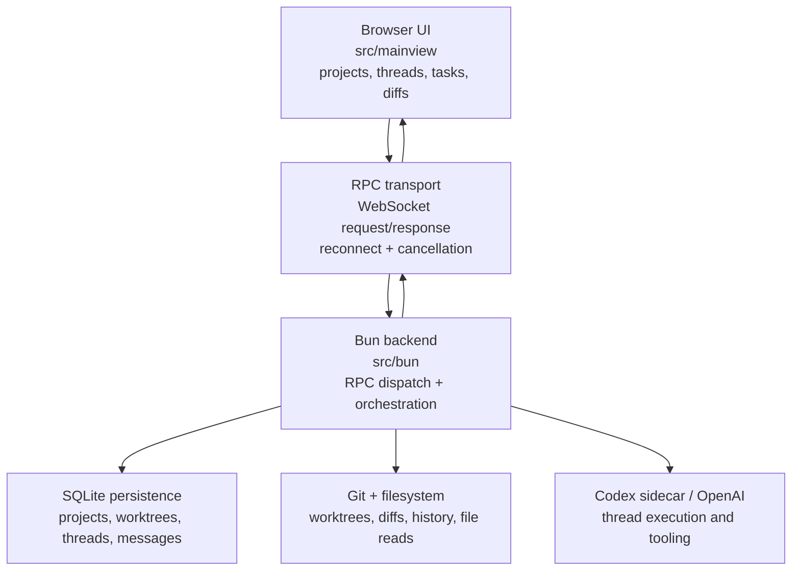

# jt-ide

`jt-ide` is a Bun + React TypeScript application that runs an opinionated local IDE workflow for Codex-backed coding sessions.
It combines:

- a Bun server/process layer (RPC handlers, persistence, polling, Git/Codex sidecar orchestration)
- a browser-first UI (`src/mainview`) for workspaces, threads, tasks, and diffs
- a typed RPC contract that keeps both sides in sync

The goal is to keep coding sessions, project state, and tool outputs tightly coupled while still exposing clean composable UI primitives.

## Why this exists

- Manage multiple Git worktrees and projects from one local interface.
- Start, monitor, and stop Codex threads tied to files/worktrees.
- Run and track project-defined tasks.
- View and diff worktree file content without leaving the app.
- Preserve responsive interactions with cancellation, background updates, and resilient reconnects.

## Big-picture architecture



## Runtime flow (how it works day-to-day)

1. **Startup**
   - `bun run src/bun/index.ts` (or `bun run start:monolith`) boots the server.
   - `bun run start:tls` starts the isolated server in reverse-proxy TLS mode so browser-facing transport is treated as HTTPS/WSS when nginx or another proxy terminates TLS upstream.
     By default that means public HTTP on `127.0.0.1:7599` and the RPC backend on `127.0.0.1:7600`, so a reverse proxy must send `/rpc` to the backend port instead of reusing the static-server upstream.
     If you want one upstream for both `/` and `/rpc`, run the monolith entrypoint with `--tls` instead.
   - The server builds/serves the mainview bundle and exposes:
     - HTTP static handlers for app assets (`index.html`, css, fonts)
     - `ws://.../rpc` on loopback, with `wss://.../rpc` expected only through a TLS-terminating reverse proxy
     - event-driven push updates for tasks/history changes
   - Runtime config is injected so the frontend connects back to the correct RPC endpoint.

2. **Frontend boot**
   - `src/mainview/index.ts` creates a WebSocket transport and pending request map.
   - A typed request envelope (`type`, `id`, `method`, `params`, `priority`) is sent per RPC.
   - Pending calls can be canceled/retried; reconnect uses exponential backoff in production and reload logic in dev.

3. **Request handling**
   - Backend maps incoming request names to handlers in `src/bun/index.ts`.
   - Handlers are imported from `src/bun/project-procedures.ts` and fan out to lower-level modules.
   - Results are normalized into WebSocket responses (`ok`, `result` / `error`).

4. **UI updates**
   - Backend procedures emit change events (e.g., task lists, git history changes).
   - Frontend bridges those messages into custom window events and updates React state.
   - The app keeps controls responsive by centralizing state sync and avoiding full refreshes.

5. **Shutdown/reload**
   - Connection lifecycle handles page unload and server restarts.
   - Invalidation logic clears in-flight requests and reconnect state.
   - Backend has configurable monitoring/maintenance hooks to recover stale polling and procedure caches.

## Project/Worktree model

The main data model is centered on three layers:

- **Projects**: high-level entry points for codebases.
- **Worktrees**: per-checkout work contexts that can be opened, closed, and switched.
- **Threads**: Codex execution sessions attached to selected worktree context.

Threads and worktrees are coordinated through procedures in `src/bun/project-procedures.ts` and related modules:

- `createWorktreeProcedure`, `openWorktreeProcedure`, `closeWorktreeProcedure`
- `createThreadProcedure`, `requestThreadStartProcedure`, `sendThreadMessageProcedure`
- `stopThreadTurnProcedure`, `shutdownActiveThreadTurns`
- `runProjectTaskProcedure`, `renameThreadProcedure`, etc.

## UI structure and how files are organized

- `src/mainview` is the browser app layer.
  - `App.tsx` is the app shell and composition root.
  - `index.ts` owns transport initialization and RPC client wiring.
  - `index.html` and `index.css` are the app entry and style container.
  - `src/mainview/app/*` contains screen sections, panels, hooks, and message rendering.
  - `src/mainview/controls/*` contains reusable controls (selects, composer, icons, search, dropdown primitives).
- `src/bun` is the server/process layer.
  - `index.ts` is the main WebSocket + HTTP host and RPC dispatcher.
  - `project-procedures.ts` is the orchestration layer for everything that mutates user-visible state.
  - `project-procedures/*` splits logic by domain (catalog, directory suggestions, tasks, history, shared helpers, and thread detail).
  - `db.ts`, `git.ts`, `rpc-schema.ts`, and `build-mainview.ts` provide persistence, VCS actions, API contracts, and build-time support.

## Developer commands

Useful scripts from `package.json`:

```bash
bun run start                 # build CSS + run isolated server
bun run start:tls             # build CSS + run isolated server in reverse-proxy TLS mode
bun run start:monolith        # build CSS + run full monolith backend
bun run dev                   # build CSS + run main dev server with CSS watch
bun run build:dev             # install + build mainview bundle
bun run validate              # biome format check + typecheck
bun run format                # auto-format with biome
bun run typecheck             # TypeScript check
bun run harness:starvation    # run starvation harness utility
```

## Environment and startup flags

- `--port` / `-p` or `JOLT_PORT` for custom server port selection.
- `--backend-only` or `JOLT_BACKEND_ONLY=1` to restrict backend mode.
- `--dev` or `JOLT_DEV=1` for development reconnect behavior and refresh hooks.
- `--tls` or `JOLT_TLS=1` when browser-facing traffic is behind a TLS-terminating reverse proxy.

## Data and performance characteristics

- Requests are tagged with priorities and can be canceled, which helps avoid stale UI updates.
- Polling and watchers are managed centrally to reduce duplicate background work.
- Git/history/thread mutations are routed through procedures so callers do not manipulate backend state directly.
- Server side supports reload-safe state with cache warming and maintenance routines (`warmProcedureStartupCaches`, `shutdownProcedureCacheMaintenance`, etc.).

## Top-level file purpose index

- `.tasks/`
  - Local process docs for commits and research.
- `.gitignore`
  - Generated/build/runtime exclusions.
- `AGENTS.md`
  - Repository instructions and canonical tree snapshot.
- `biome.json`
  - Linting/formatting rules.
- `bun-plugin-react-compiler.ts`
  - Bun plugin entry used with React compiler integration.
- `bun.lock`, `package.json`, `tsconfig.json`, `bunfig.toml`
  - Tooling + dependency + compiler + Bun execution config.
- `docs/`
  - Repository design notes, audits, and migration references.
- `src/`
  - Source of truth for backend and frontend architecture.

## Contributing notes

- Keep frontend and backend RPC contracts aligned in `src/bun/rpc-schema.ts`.
- Prefer clear comments for edge-case behavior (cancellations, open/close sequencing, stale-response handling).
- Run docs + format/style checks according to `bun run validate` before non-doc code changes.
