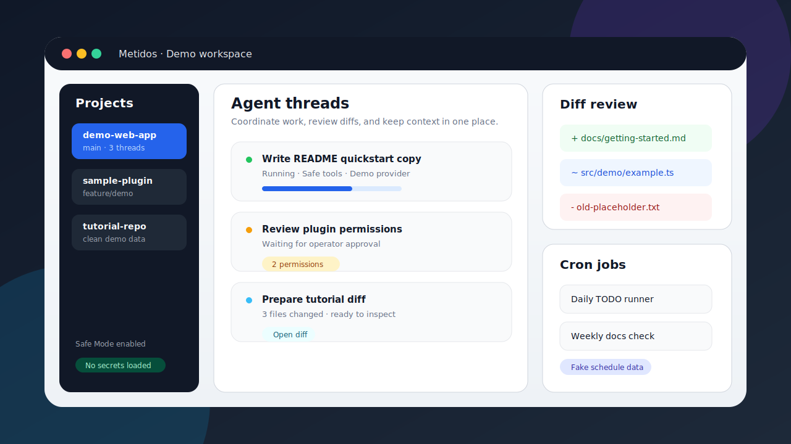
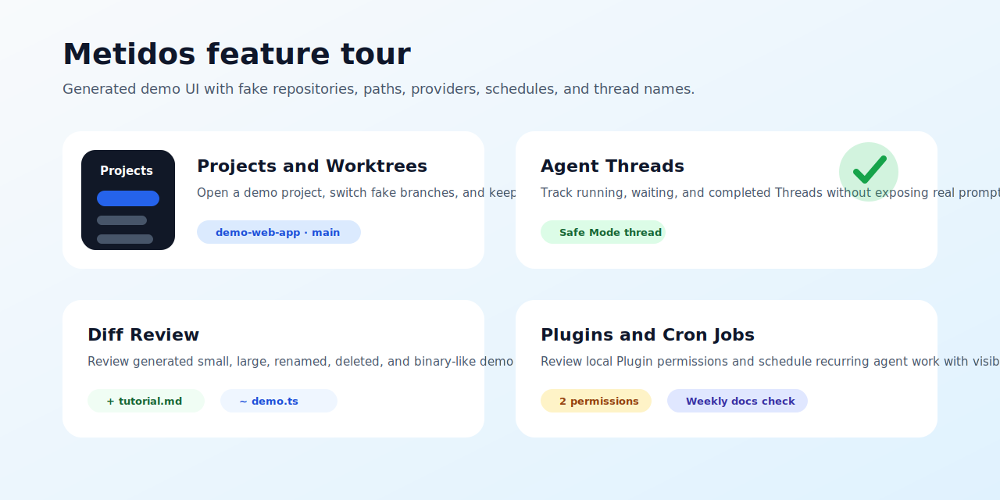
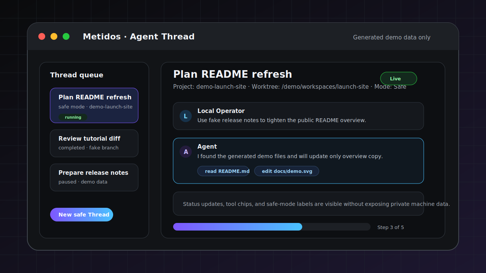

# Metidos

  
  
  
  

  

Metidos is a local workspace for developers who use AI coding agents. It brings Projects, Worktrees, Threads, Diffs, tasks, Plugins, and Cron Jobs into one calmer place so you can focus on the work instead of juggling terminals and tabs.

The name comes from *mētis*: practical wisdom, good judgment, and knowing the right move at the right time.

*Demo screenshot with fake project names and generated data only.*

## Status

Metidos is pre-1.0 local developer tooling. Expect rough edges, changing APIs, and incomplete public-release polish. Keep backups of important local data, review Plugin and Provider access carefully, and do not treat Unsafe Mode or unreviewed Plugins as safe defaults.

## What Metidos is

Metidos combines:

- a local Bun Backend for Projects, Git, persistence, Local Auth, Plugins, Cron Jobs, and runtime orchestration;
- a Pi-powered Agent runtime adapter for model selection, tools, Sessions, and Thread execution;
- a React/Tailwind Mainview for managing work across Projects and Worktrees.

It is designed for one Local Operator running a local installation, not for hosted multi-tenant use.

## What Metidos helps with

- Coordinate many AI coding Threads across multiple Projects and Worktrees.
- Keep Agent work, human edits, Diffs, tasks, and Cron Jobs visible in one UI.
- Connect Providers and approved local Plugins without hiding their Permissions.
- Review file changes before they land.
- Preserve useful context across sessions while keeping local data under operator control.

## Visual feature tour

The generated tour image uses fake project names, fake provider state, fake schedules, and generated interface examples only. It highlights the everyday public-demo flow: choose a Project and Worktree, run or resume Agent Threads, inspect Diffs, review Plugin permissions, and schedule Cron Jobs without exposing private paths, usernames, hostnames, tokens, real repositories, branches, or customer/user data.

The Agent Thread demo is generated from fake prompts, fake project names, fake worktree paths, and safe-mode status examples only. It is intended for public docs and avoids real logs, provider output, local paths, hostnames, usernames, tokens, private branches, and customer/user data.

## Core concepts

- **Projects** are high-level entries for one or more Worktrees.
- **Worktrees** are concrete Git checkout contexts where Threads and tools operate.
- **Threads** are Pi-powered agent execution sessions attached to a selected Project and Worktree.
- **Diffs** show changed files so agent or human edits can be reviewed before they are kept.
- **Cron Jobs** schedule future agent work.
- **Plugins** are local, review-first extension folders approved by the Local Operator.
- **Providers** connect Metidos and Pi to model services, including local, built-in, and plugin-backed providers.

## Safety and scope

Metidos is not a sandbox for arbitrary untrusted code, a replacement for code review and tests, or a stable plugin marketplace yet. Treat App Data, diagnostics, plugin-authored logs, provider credentials, and project paths as private local information.

## Security model summary

Metidos assumes a single **Local Operator** controls one local installation. Local Auth protects browser access with first-run setup, sessions, WebSocket tickets, optional TOTP, recovery codes, and step-up authentication for sensitive plugin actions.

The Bun Backend is the security authority. It validates sessions, owns provider credentials and Plugin Settings, enforces Project and Worktree path scope, applies filesystem containment checks, mediates network-capable features, and decides when Safe Mode or Unsafe Mode capabilities are available. The Mainview presents choices but does not grant security-sensitive access by itself.

Plugins are local, review-first extensions. They require manifests, `AGENTS.md` guidance, operator approval, declared permissions, access groups for Thread-visible tools, settings validation, and secret redaction. Review file and network allowlists before enabling a plugin, and re-review after source changes.

Safe Mode is the default for Threads and Cron Jobs. Unsafe Mode can broaden runtime capabilities, including shell or other risky local operations, and should only be enabled for narrow, trusted work. See [`docs/security-model.md`](docs/security-model.md) for the full model, including filesystem boundaries, network policy, remote access, backups, and safe issue reporting.

## Documentation

The README is intentionally an overview. Setup, tutorial, and installer details live in the dedicated install guide and installer skill:

- [`INSTALLATION.md`](INSTALLATION.md) — canonical installation guide and first-run tutorial.
- [`.pi/skills/metidos-installation/SKILL.md`](.pi/skills/metidos-installation/SKILL.md) — interactive plan-first installer workflow.
- [`docs/README.md`](docs/README.md) — full documentation index.

Useful reference docs:

- [`docs/architecture.md`](docs/architecture.md) — system architecture and data flows.
- [`docs/security-model.md`](docs/security-model.md) — Local Auth, secrets, Plugins, filesystem, network, backups, and safe issue reporting.
- [`docs/plugin-system.md`](docs/plugin-system.md) — Plugin System v1 overview.
- [`docs/development.md`](docs/development.md) — contributor workflow, validation, and debugging.
- [`SUPPORT.md`](SUPPORT.md), [`SECURITY.md`](SECURITY.md), and [`ROADMAP.md`](ROADMAP.md) — support, disclosure, and project direction.

## Repository map

- `src/bun/` — Backend, persistence, Git, RPC handlers, Plugins, Cron Jobs, and runtime orchestration.
- `src/mainview/` — browser UI.
- `core_plugins/` — first-party plugin source.
- `docs/` — operator, architecture, security, plugin, development, and release docs.
- `.pi/skills/` — repo-local agent skills for workflows such as installation, commits, QA, research, and plugin authoring.
- `.wiki/` — durable project knowledge and research notes.

## License

Metidos is released under the Apache License, Version 2.0. See [`LICENSE`](LICENSE).
