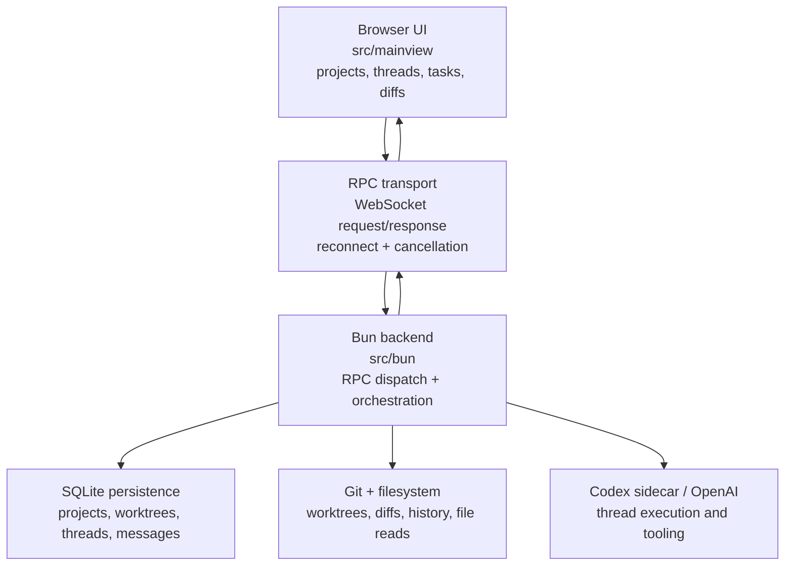

# Metidos

Metidos is a Bun + React TypeScript application that runs an opinionated local IDE workflow for Codex-backed coding sessions.

**Metidos** takes its name from *mētis*: counsel, cunning, skill, and practical wisdom, the craft of choosing the right move at the right time. Inspired by Metis, the Greek figure of strategic intelligence, Metidos is built for developers working across many threads at once: code, tasks, worktrees, diffs, tools, and long-running agent sessions. Its purpose is not to replace judgment, but to sharpen it, keeping complex work coherent, deliberate, and in hand.

It combines:

- a Bun server/process layer (RPC handlers, persistence, polling, Git/Codex sidecar orchestration)
- a browser-first UI (`src/mainview`) for workspaces, threads, tasks, and diffs
- a typed RPC contract that keeps both sides in sync

The goal is to keep coding sessions, project state, and tool outputs tightly coupled while still exposing clean composable UI primitives.

## Why this exists

- Manage multiple Git worktrees and projects from one local interface.
- Start, monitor, and stop Codex threads tied to files/worktrees.
- Run and track project-defined tasks.
- View and diff worktree file content without leaving the app.
- Preserve responsive interactions with cancellation, background updates, and resilient reconnects.
- Create and manage cron jobs from the Cronjobs workspace.

## Getting Started

Configure at least one model provider before opening a thread. Providers that are missing their required setup are shown as disabled in the model selector.

For OpenAI Codex, use the Codex CLI with file-backed auth so Metidos can reuse the shared session:

```bash
codex login
```

The provider env requirements are:

| Provider | Required env vars | Notes |
|----------|-------------------|-------|
| OpenAI API | `OPENAI_API_KEY` | Standard OpenAI Platform key. |
| OpenAI Codex | none | Uses `codex login` with file-backed auth instead of an API key env var. |
| Ollama (custom provider via Pi) | none by default | Configure the endpoint in Metidos's Pi `models.json`. Pi still requires an `apiKey` field there, but Ollama ignores it, so any literal value works. |
| Anthropic | `ANTHROPIC_API_KEY` | `ANTHROPIC_OAUTH_TOKEN` also works if you already manage Anthropic auth that way. |
| Google Gemini | `GEMINI_API_KEY` | Used for the `google` provider. |
| Google Vertex | `GOOGLE_CLOUD_API_KEY` or `GOOGLE_CLOUD_PROJECT` / `GCLOUD_PROJECT` + `GOOGLE_CLOUD_LOCATION` | Pi also supports ADC-backed Vertex auth. |
| Azure OpenAI | `AZURE_OPENAI_API_KEY` + `AZURE_OPENAI_BASE_URL` or `AZURE_OPENAI_RESOURCE_NAME` | `AZURE_OPENAI_API_VERSION` and `AZURE_OPENAI_DEPLOYMENT_NAME_MAP` are optional. |
| Amazon Bedrock | `AWS_ACCESS_KEY_ID` + `AWS_SECRET_ACCESS_KEY`, or `AWS_PROFILE`, or `AWS_BEARER_TOKEN_BEDROCK` | `AWS_REGION` is usually needed in practice unless your environment already provides it. |
| Groq | `GROQ_API_KEY` | Used for the `groq` provider. |
| Kimi Coding | `KIMI_API_KEY` | Used for the `kimi-coding` provider. |
| MiniMax | `MINIMAX_API_KEY` | Used for the `minimax` provider. |
| Mistral | `MISTRAL_API_KEY` | Used for the `mistral` provider. |
| OpenRouter | `OPENROUTER_API_KEY` | Used for the `openrouter` provider. |
| xAI | `XAI_API_KEY` | Used for the `xai` provider. |
| Z.AI | `ZAI_API_KEY` | Used for the `zai` provider. |

For Ollama and other Pi custom providers, Metidos reads Pi model config from its own app-data directory at `.../pi-agent/models.json`, not from Pi's standalone `~/.pi/agent/models.json`. Use `METIDOS_APP_DATA_DIR` only if you want to relocate that Metidos-owned Pi config root. There is no built-in `OLLAMA_BASE_URL` or `OLLAMA_API_KEY` env contract in Metidos for the endpoint itself. Metidos now shows Ollama as a disabled provider in the model selector until it has settings, and the Settings panel exposes only `Ollama URL` and `Ollama key`. Metidos uses those values to query the Ollama models endpoint and rewrite the Pi `models.json` entry for you. See [docs/2026-04-10-ollama-via-pi-configuration.md](docs/2026-04-10-ollama-via-pi-configuration.md).

Start the app:

```bash
bun run start
```

## Big-picture architecture



## Runtime flow (how it works day-to-day)

1. **Startup**
   - `bun run src/bun/index.ts` (or `bun run start`) boots the server.
   - `bun run start:telemetry` boots the same server with `--track-telemetry` so periodic runtime snapshots are persisted into the sidecar telemetry database.
   - `bun run start:tls` starts the same single-port server in reverse-proxy TLS mode so browser-facing transport is treated as HTTPS/WSS when nginx or another proxy terminates TLS upstream.
   - `bun run start:tls:telemetry` combines reverse-proxy TLS mode with `--track-telemetry`.
     Bun auto-loads `.env` for these scripts; set `METIDOS_PUBLIC_ORIGIN=https://notwindows` in `.env` and the backend will automatically fold that origin into the websocket allowlist. Use `METIDOS_ALLOWED_WS_ORIGINS` only when you need additional browser-facing origins.
     Point both `/` and `/rpc` at the same backend upstream, and preserve `X-Forwarded-Host` plus `X-Forwarded-Proto` so websocket origin checks see the browser origin.
   - The server builds/serves the mainview bundle and exposes:
     - HTTP static handlers for app assets, with `index.html` served as `no-store` and versioned frontend assets under `/assets/mainview/<version>/...`
     - `ws://.../rpc` on loopback, with `wss://.../rpc` expected only through a TLS-terminating reverse proxy
     - The frontend obtains a short-lived `/auth/ws-ticket` and connects with `?ticket=...` plus authenticated session context.
     - event-driven push updates for tasks/history changes
   - Runtime config is injected so the frontend connects back to the correct RPC endpoint.

2. **Frontend boot**
   - `src/mainview/index.ts` creates a WebSocket transport and pending request map.
   - It acquires a ticket through `/auth/ws-ticket` before opening `/rpc`, then reconnects/retries on transient failures.
  - A typed request envelope (`type`, `id`, `method`, `params`, `priority`) is sent per RPC.
   - Pending calls can be canceled/retried; reconnect uses exponential backoff in production and reload logic in dev.

3. **Request handling**
   - Backend maps incoming request names to handlers in `src/bun/index.ts`.
   - Handlers are imported from `src/bun/project-procedures.ts` and fan out to lower-level modules.
   - Results are normalized into WebSocket responses (`ok`, `result` / `error`).

4. **UI updates**
   - Backend procedures emit change events (e.g., task lists, git history changes).
   - Frontend bridges those messages into custom window events and updates React state.
   - The app keeps controls responsive by centralizing state sync and avoiding full refreshes.

5. **Shutdown/reload**
   - Connection lifecycle handles page unload and server restarts.
   - Invalidation logic clears in-flight requests and reconnect state.
   - Backend has configurable monitoring/maintenance hooks to recover stale polling and procedure caches.

## Cronjobs workspace

- The cron view now includes a **New Cron** button in the workspace header.
- **Describe Cron** opens a text input and sends a message through the normal thread/message path, using `new_cron` tooling to create the job from natural language.
- **Edit Cron** opens explicit cron fields (`title`, `description`, `schedule`, `prompt`, `enabled`) and creates the job directly.
- `newCron`/`updateCron` operations are written through existing DB-backed procedures and then notify the scheduler worker with the changed cron id.
- The scheduler uses targeted sync instead of full worker restarts:
  - `sidecar-cron-scheduler.ts` sends `sync` messages for one cron id.
  - `sidecar-cron-thread.ts` applies updates in a serialized queue, unregisters previous registrations for that id, and re-registers when enabled.
  - Full restart remains only for process startup/shutdown.

## Project/Worktree model

The main data model is centered on three layers:

- **Projects**: high-level entry points for codebases.
- **Worktrees**: per-checkout work contexts that can be opened, closed, and switched.
- **Threads**: Codex execution sessions attached to selected worktree context.

Threads and worktrees are coordinated through procedures in `src/bun/project-procedures.ts` and related modules:

- `createWorktreeProcedure`, `openWorktreeProcedure`, `closeWorktreeProcedure`
- `createThreadProcedure`, `requestThreadStartProcedure`, `sendThreadMessageProcedure`
- `stopThreadTurnProcedure`, `shutdownActiveThreadTurns`
- `runProjectTaskProcedure`, `renameThreadProcedure`, etc.

## UI structure and how files are organized

- `src/mainview` is the browser app layer.
  - `App.tsx` is the app shell and composition root.
  - `index.ts` owns transport initialization and RPC client wiring.
  - `index.html` is the HTML entry template and `index.css` is the generated style container; the server injects the current versioned `/assets/mainview/<version>` root into the HTML at response time.
  - `src/mainview/app/*` contains screen sections, panels, hooks, and message rendering.
  - `src/mainview/controls/*` contains reusable controls (selects, composer, icons, search, dropdown primitives).
- `src/bun` is the server/process layer.
  - `index.ts` is the main WebSocket + HTTP host and RPC dispatcher.
  - `sidecar-cron-scheduler.ts` controls the cron scheduler worker lifecycle.
  - `sidecar-cron-thread.ts` receives scheduler commands (`start`, `sync`, `stop`) and manages Bun.cron registrations.
  - `sidecar-cron-runner.ts` executes cron jobs by creating and running thread turns.
  - `project-procedures.ts` is the orchestration layer for everything that mutates user-visible state.
  - `project-procedures/*` splits logic by domain (catalog, directory suggestions, tasks, history, shared helpers, and thread detail).
  - `db.ts`, `git.ts`, `rpc-schema.ts`, and `build-mainview.ts` provide persistence, VCS actions, API contracts, and build-time support.

## Developer commands

Useful scripts from `package.json`:

```bash
bun run start                 # build CSS + run server
bun run start:telemetry       # build CSS + run server with runtime telemetry sidecar persistence
bun run start:tls             # build CSS + run server in reverse-proxy TLS mode (reads .env)
bun run start:tls:telemetry   # build CSS + run TLS-mode server with telemetry sidecar persistence (reads .env)
bun run dev                   # build CSS + run main dev server with CSS watch
bun run build:dev             # install + build unminified mainview bundle with sourcemaps
bun run build:prod            # install + build minified mainview bundle (no sourcemap by default)
bun run validate              # biome format check + typecheck
bun run format                # auto-format with biome
bun run typecheck             # TypeScript check
bun run harness:starvation    # run starvation harness utility
```

## Environment and startup flags

- `--port` / `-p` or `METIDOS_PORT` for custom server port selection.
- `--backend-only` or `METIDOS_BACKEND_ONLY=1` to restrict backend mode.
- `--dev` or `METIDOS_DEV=1` for development reconnect behavior and refresh hooks.
- `--tls` or `METIDOS_TLS=1` when browser-facing traffic is behind a TLS-terminating reverse proxy.
- `--track-telemetry` to persist periodic runtime-stat snapshots into a separate sidecar SQLite database under the app-data directory.
- `--wipe-user-data` to confirm, delete the local SQLite database files (including the telemetry sidecar DB when present), and exit before startup.
- `METIDOS_ALLOWED_WS_ORIGINS` for extra browser origins when you proxy through a non-default host or port.
- `METIDOS_PUBLIC_ORIGIN` as the primary browser-facing origin used by reverse-proxy TLS mode; the backend automatically adds it to the websocket allowlist.
- `METIDOS_APP_DATA_DIR` for an explicit per-user application data location.
- `METIDOS_MAINVIEW_SOURCEMAP=1` to emit and serve the versioned mainview sourcemap path (for example `/assets/mainview/<version>/index.js.map`) for non-dev builds when you need production bundle debugging.

For local startup, Bun auto-loads `.env`; copy `.env.example` to `.env` and set `METIDOS_PUBLIC_ORIGIN=https://notwindows` when you want the reverse-proxy TLS scripts to accept that host.

## Data and performance characteristics

- Requests are tagged with priorities and can be canceled, which helps avoid stale UI updates.
- Polling and watchers are managed centrally to reduce duplicate background work.
- Git/history/thread mutations are routed through procedures so callers do not manipulate backend state directly.
- Server side supports reload-safe state with cache warming and maintenance routines (`warmProcedureStartupCaches`, `shutdownProcedureCacheMaintenance`, etc.).

## Top-level file purpose index

- `.tasks/`
  - Local process docs for commits and research.
- `.gitignore`
  - Generated/build/runtime exclusions.
- `AGENTS.md`
  - Repository instructions and canonical tree snapshot.
- `biome.json`
  - Linting/formatting rules.
- `bun-plugin-react-compiler.ts`
  - Bun plugin entry used with React compiler integration.
- `bun.lock`, `package.json`, `tsconfig.json`, `bunfig.toml`
  - Tooling + dependency + compiler + Bun execution config.
- `docs/`
  - Repository design notes, audits, and migration references.
  - `docs/front-end/` is the living research index for web UI and UX techniques, with `GOALS.md` as the first stop for new research passes.
- `src/`
  - Source of truth for backend and frontend architecture.

## Contributing notes

- Keep frontend and backend RPC contracts aligned in `src/bun/rpc-schema.ts`.
- Prefer clear comments for edge-case behavior (cancellations, open/close sequencing, stale-response handling).
- Run docs + format/style checks according to `bun run validate` before non-doc code changes.
