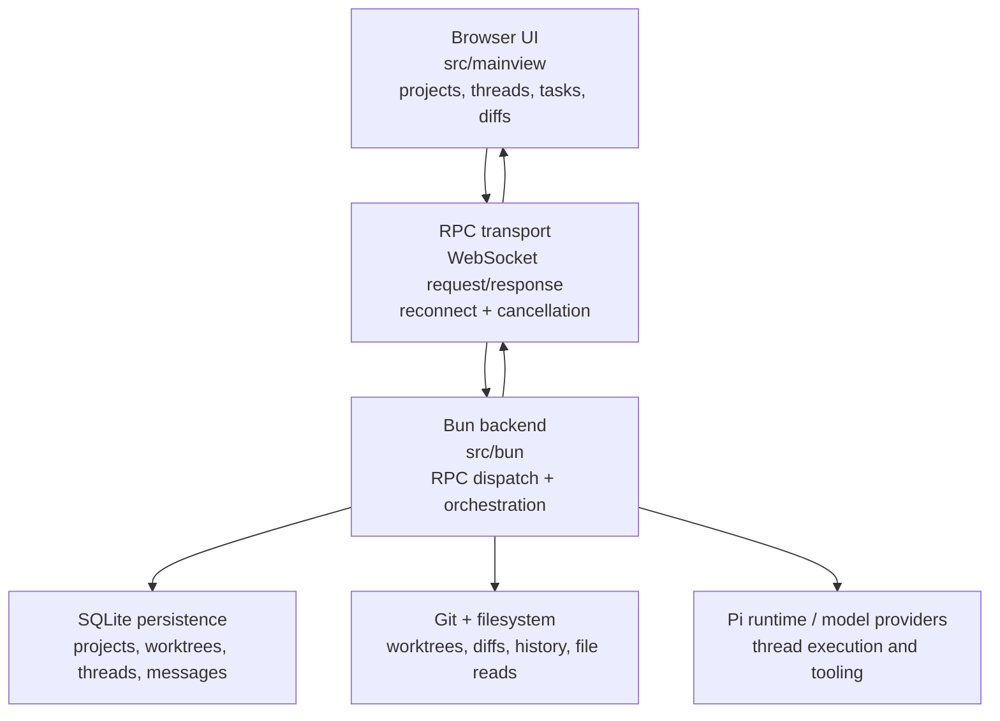

# Metidos

Metidos is a Bun + React TypeScript application that runs an opinionated local IDE workflow for Pi-backed coding sessions across OpenAI Codex, OpenAI API, Anthropic, Google, Ollama, Build NVIDIA, and other providers.

**Metidos** takes its name from *mētis*: counsel, cunning, skill, and practical wisdom, the craft of choosing the right move at the right time. Inspired by Metis, the Greek figure of strategic intelligence, Metidos is built for developers working across many threads at once: code, tasks, worktrees, diffs, tools, and long-running agent sessions. Its purpose is not to replace judgment, but to sharpen it, keeping complex work coherent, deliberate, and in hand.

It combines:

- a Bun server/process layer (HTTP/RPC, persistence, auth, cron execution, Plugin System v1 sidecars, Git/Pi runtime orchestration)
- a browser-first UI (`src/mainview`) for projects, worktrees, threads, tasks, calendars, plugins, and diffs
- a typed RPC contract that keeps both sides in sync

The goal is to keep coding sessions, project state, and tool outputs tightly coupled while still exposing clean composable UI primitives.

## Why this exists

- Manage multiple Git worktrees and projects from one local interface.
- Start, monitor, and stop provider-backed threads tied to files/worktrees.
- Run and track project-defined tasks.
- View and diff worktree file content without leaving the app.
- Approve local plugins that add tools, notification providers, model providers, crons, or data-backed extension behavior.
- Use calendar, notification, browser-plugin, web-server, Git, GitHub, SQLite, LanceDB/vector-search, and agent-coordination tool families per thread.
- Preserve responsive interactions with cancellation, background updates, and resilient reconnects.
- Create and manage cron jobs from the cron workspace.

## Getting Started

### 1. Install dependencies and create a local env file

```bash
bun install
cp .env.example .env
```

Bun auto-loads `.env` for `bun run ...` commands. For env-backed providers, add the provider vars you want to `.env`, then restart Metidos after each change.

### 2. Configure at least one model provider

Metidos shows providers that are missing setup as disabled in the model selector.

| Provider in Metidos | How to enable |
|---------------------|---------------|
| OpenAI API | Add `OPENAI_API_KEY=...` to `.env`, or approve the OpenAI core plugin and save `api_key` in Settings -> Plugins. Pi owns the built-in chat provider, model catalog, endpoint metadata, and transport; the core plugin also registers OpenAI embedding models for Metidos vector search. |
| OpenAI Codex | Install the `codex` CLI, run `codex login`, and make sure the CLI is on `PATH`. Metidos uses Pi's built-in `openai-codex` provider; the Codex core plugin imports `plugins/codex/.data/auth.json` when present and otherwise falls back to `$CODEX_HOME/auth.json` or `~/.codex/auth.json`. No plugin-defined provider is registered. |
| GitHub Copilot | Approve the GitHub Copilot core plugin and point it at a Pi auth JSON containing a `github-copilot` OAuth entry, usually produced by Pi login and mounted/copied to `plugins/github_copilot/.data/auth.json` or referenced through `GITHUB_COPILOT_AUTH_JSON_PATH`. Pi owns the built-in `github-copilot` provider, OAuth refresh, model catalog, and transport. |
| Anthropic | Add `ANTHROPIC_API_KEY=...` to `.env`, or approve the settings-only Anthropic core plugin and save `api_key` in Settings -> Plugins. `ANTHROPIC_OAUTH_TOKEN` also works through Pi's normal env fallback. |
| Google | Add `GEMINI_API_KEY=...` to `.env` and restart. |
| Google Vertex | Add either `GOOGLE_CLOUD_API_KEY=...` or both `GOOGLE_CLOUD_PROJECT=...` (or `GCLOUD_PROJECT=...`) and `GOOGLE_CLOUD_LOCATION=...`, then restart. Pi can also use ADC once those project/location settings are present. |
| Azure OpenAI | Add `AZURE_OPENAI_API_KEY=...` plus either `AZURE_OPENAI_BASE_URL=...` or `AZURE_OPENAI_RESOURCE_NAME=...`, then restart. `AZURE_OPENAI_API_VERSION` and `AZURE_OPENAI_DEPLOYMENT_NAME_MAP` are optional. |
| Amazon Bedrock | Configure one of: `AWS_PROFILE=...`, `AWS_BEARER_TOKEN_BEDROCK=...`, or both `AWS_ACCESS_KEY_ID=...` and `AWS_SECRET_ACCESS_KEY=...`. In practice you usually also want `AWS_REGION=...`. Restart Metidos after changing env. |
| Groq | Add `GROQ_API_KEY=...` to `.env` and restart. |
| Kimi Coding | Add `KIMI_API_KEY=...` to `.env` and restart. |
| MiniMax | Add `MINIMAX_API_KEY=...` to `.env` and restart. |
| Mistral | Add `MISTRAL_API_KEY=...` to `.env` and restart. |
| OpenRouter | Add `OPENROUTER_API_KEY=...` to `.env`, or approve the OpenRouter core plugin and save `api_key` in Settings -> Plugins. The plugin registers chat and embedding providers, discovers models from OpenRouter's upstream catalogs, routes embeddings through OpenRouter, and still lets Pi supply the OpenAI-compatible chat transport. |
| Inception Labs Mercury | Add `INCEPTION_API_KEY=...` to `.env`, or approve the Inception Labs Mercury core plugin and save `api_key` in Settings -> Plugins. The plugin registers Mercury 2 as an OpenAI-compatible provider. |
| xAI | Add `XAI_API_KEY=...` to `.env`, or approve the xAI core plugin and save `api_key` in Settings -> Plugins. The plugin registers the provider and discovers current chat/coding models from xAI's upstream `/v1/models` endpoint. |
| Z.AI | Add `ZAI_API_KEY=...` to `.env`, or approve the Z.AI core plugin and save `api_key` in Settings -> Plugins. The plugin registers the `zai` provider and defaults to the General API endpoint for long-lived console API keys; switch the plugin `endpoint` setting to `coding_plan` only for Coding Plan tokens. |
| Build NVIDIA | Approve the Build NVIDIA core plugin and save the `api_key` Plugin Setting in Settings -> Plugins, or add `NVIDIA_API_KEY=...` to `.env` and restart. The plugin registers a Plugin System v1 model provider and discovers chat models from NVIDIA's `/v1/models` endpoint when a key is available. If discovery fails or returns no models, Metidos shows no Build NVIDIA models instead of inventing fallback entries. |
| Ollama | Approve the Ollama core plugin and optionally save the `base_url` and `api_key` Plugin Settings in Settings -> Plugins, or set `OLLAMA_BASE_URL=...` and optional `OLLAMA_API_KEY=...` in `.env`. The plugin registers a Plugin System v1 provider, defaults to `http://localhost:11434`, discovers native `/api/tags` first, falls back to `/v1/models`, and returns no models when discovery fails rather than inventing a placeholder. Container deployments that reach host Ollama through a private/loopback address must include `ollama` in `METIDOS_PLUGIN_UNSAFE_PRIVATE_NETWORK_PLUGINS` and approve the plugin's unsafe permission. |

Notes:

- Metidos keeps its Pi auth and registry state under its own app-data directory at `<app-data>/pi-agent/`, not Pi's standalone `~/.pi/agent/`. Newly created app-data directory trees are tightened to owner-only POSIX permissions where supported. Plugin-backed providers such as Ollama and Build NVIDIA are registered by approved Plugin System v1 sidecars and then projected into the Pi registry/catalog at runtime.
- Metidos keeps **OpenAI API** and **OpenAI Codex** as separate providers even when they expose the same raw model id such as `gpt-5.4`. Choose the one that matches the auth, billing, and policy boundary you want.
- More detail on provider wiring lives in [Ollama via Pi Configuration](.wiki/ollama-via-pi-configuration.md), [Build NVIDIA via Pi Configuration](.wiki/nvidia-build-via-pi-configuration.md), [OpenRouter via Core Plugin](.wiki/openrouter-via-pi-configuration.md), and [Codex via Pi Wiring](.wiki/codex-via-pi-wiring.md). Pi-built-in providers generally use Pi's catalog; first-party core plugins that declare `provider:register` own their provider's runtime catalog.

### 3. Enable thread and cron features

| Feature | How to enable | Extra setup |
|---------|---------------|-------------|
| Web Search | Turn on **Web Search** in the thread or cron access controls. | For `OpenAI API` and `OpenAI Codex` GPT-5/o3/o4-class models, Metidos uses provider-native web search. For other providers, Metidos falls back to Brave-backed `web_search` plus direct `web_fetch`; set `BRAVE_SEARCH_API_KEY` for fallback search. |
| Browser plugins | Approve and select a browser-control plugin access group, such as `chrome_browser:browser_tools`. | For the Chrome browser plugin, install Chrome/Chromium or use the bundled/container Chromium setup; screenshots and browser control are plugin-provided rather than native Metidos WebView tools. |
| GitHub | Turn on **GitHub** in the access controls. | Install GitHub CLI (`gh`), ensure it is on `PATH`, and authenticate with `gh auth login`. The current worktree must resolve to a GitHub repository. |
| Git | Turn on **Git** in the access controls. | Install `git` and keep the worktree inside a Git repository. |
| SQLite | Turn on **SQLite** in the access controls. | No extra global setup. Queries are limited to database files inside the current worktree. |
| LanceDB | Turn on **LanceDB** in the access controls. | Enables project-scoped vector tools: `lancedb_upsert`, `lancedb_query`, and `lancedb_delete`. Query text is embedded through the configured Metidos embedding provider, such as the approved OpenAI or Ollama core plugin. |
| WebServer | Turn on **WebServer** in the access controls. | Hosts files from the current worktree through `web_server_host`, `web_server_stop`, and `web_server_list`; stable share routes use the share worker. |
| Calendar | Turn on **Calendar** in the access controls. | No extra global setup. |
| Notifications | Turn on **Notifications** in the access controls. | Configure a notification provider such as the ntfy core plugin if you want delivery outside the app. |
| Threads | Turn on **Threads** in the access controls. | Enables Metidos thread listing and child-thread tools. |
| Crons | Turn on **Crons** in the access controls. | Enables Metidos cron listing, creation, and update tools. |
| Agents | Turn on **Agents** in the access controls. | No extra setup. |
| Plugin tools | Select approved plugin access groups in the access controls. | Access groups expose agent-visible plugin tools; plugin host API permissions still come from the approved manifest. The Gmail core plugin provides separate read and draft-only access groups; configure Google OAuth client settings and the local Gmail refresh token before enabling those tools. Internal prompt-injection capability is not shown as a normal user-selectable tool family. |
| Terminal tools | Enable the full unsafe terminal policy intentionally. | Managed terminal tools are high-risk and are exposed only through the unsafe Metidos terminal path. |
| Unsafe | Turn on **Unsafe** in the access controls only when you intentionally want broader execution. | Unsafe mode enables bash and allows unsafe child threads/cron jobs. |

Gmail plugin setup: approve the Gmail core plugin in Settings -> Plugins, provide the `client_id` and `client_secret` Plugin Settings or env `GMAIL_CLIENT_ID` / `GMAIL_CLIENT_SECRET`, save the local Gmail `refresh_token` Plugin Setting, then enable either **Gmail - Read** or **Gmail - Drafts only** per thread. The plugin uses direct Google OAuth and Gmail REST fetches rather than the Google API package, and it cannot send email from Metidos.

### 4. Run the server

Metidos runs one Bun server that serves the browser app, auth routes, websocket RPC endpoint, and versioned frontend assets from the same process. It listens on loopback (`127.0.0.1`) rather than binding directly to the public network.

Choose the startup mode that matches your environment:

| Mode | Command | Use when |
|------|---------|----------|
| Local HTTP | `bun run start` | Normal local use on `http://localhost:7599`. |
| Local HTTP + telemetry | `bun run start:telemetry` | Same as above, but also persists runtime telemetry snapshots. |
| Local dev | `bun run dev` | Active local development with CSS watch and dev reload behavior. |
| Custom port | `METIDOS_PORT=7605 bun run start` or `bun run src/bun/index.ts --port 7605` | You want the Bun backend on a different loopback port. |
| Reverse-proxy TLS | `bun run start:tls` | Nginx or another reverse proxy terminates TLS and forwards to Bun over loopback HTTP. |
| Reverse-proxy TLS + telemetry | `bun run start:tls:telemetry` | Reverse-proxy TLS mode plus runtime telemetry persistence. |

Quick notes:

- The default backend port is `7599`.
- Bun serves on loopback only, so the reverse proxy target is the local Bun server, typically `http://127.0.0.1:7599`.
- `start:tls` does **not** make Bun terminate TLS itself. It tells Metidos to treat the public/browser-facing transport as `https://` and `wss://` while the reverse proxy handles certificates.
- After changing `.env` or provider env vars, restart Metidos.

Typical local startup:

```bash
bun run start
```

Then open `http://localhost:7599` in your browser.

If you are putting Metidos behind nginx or another TLS-terminating reverse proxy, use `bun run start:tls` and follow the detailed setup in [TLS / reverse-proxy setup (detailed)](#tls--reverse-proxy-setup-detailed).

After startup, open **Settings** to verify provider status, then create a thread using a model from one of the enabled providers.

## Big-picture architecture



## Runtime flow (how it works day-to-day)

1. **Startup**
   - `bun run src/bun/index.ts` (or `bun run start`) boots the server.
   - `bun run start:telemetry` boots the same server with `--track-telemetry` so periodic runtime snapshots are persisted into the sidecar telemetry database.
   - `bun run start:tls` starts the same single-port server in reverse-proxy TLS mode so browser-facing transport is treated as HTTPS/WSS when nginx or another proxy terminates TLS upstream.
   - `bun run start:tls:telemetry` combines reverse-proxy TLS mode with `--track-telemetry`.
     Bun auto-loads `.env` for these scripts; set `METIDOS_PUBLIC_ORIGIN=https://metidos.example.com` in `.env` and the backend will automatically fold that origin into the websocket allowlist. Use `METIDOS_ALLOWED_WS_ORIGINS` only when you need additional browser-facing origins.
     The easiest nginx setup proxies the whole site to Bun. If you split locations, make sure `/`, `/auth/*`, `/rpc`, and `/assets/mainview/*` still hit the same backend origin, preserve `Host`, `X-Forwarded-Host`, and `X-Forwarded-Proto`, and send websocket upgrade headers on `/rpc`.
   - The server builds/serves the mainview bundle and exposes:
     - HTTP static handlers for app assets, with `index.html` served as `no-store` and versioned frontend assets under `/assets/mainview/<version>/...`
     - `ws://.../rpc` on loopback, with `wss://.../rpc` expected only through a TLS-terminating reverse proxy
     - The frontend obtains a short-lived `/auth/ws-ticket` and connects with `?ticket=...` plus authenticated session context.
     - event-driven push updates for tasks/history changes
   - Runtime config is injected so the frontend connects back to the correct RPC endpoint.

2. **Frontend boot**
   - `src/mainview/index.ts` creates a WebSocket transport and pending request map.
   - It acquires a ticket through `/auth/ws-ticket` before opening `/rpc`, then reconnects/retries on transient failures.
  - A typed request envelope (`type`, `id`, `method`, `params`, `priority`) is sent per RPC.
   - Pending calls can be canceled/retried; reconnect uses exponential backoff in production and reload logic in dev.

3. **Request handling**
   - Backend maps incoming request names to handlers in `src/bun/index.ts`.
   - Handlers are imported from `src/bun/project-procedures.ts` and fan out to lower-level modules.
   - Results are normalized into WebSocket responses (`ok`, `result` / `error`).

4. **UI updates**
   - Backend procedures emit change events (e.g., task lists, git history changes).
   - Frontend bridges those messages into custom window events and updates React state.
   - The app keeps controls responsive by centralizing state sync and avoiding full refreshes.

5. **Shutdown/reload**
   - Connection lifecycle handles page unload and server restarts.
   - Invalidation logic clears in-flight requests and reconnect state.
   - Backend has configurable monitoring/maintenance hooks to recover stale polling and procedure caches.

## Cron workspace

- The cron view now includes a **New Cron** button in the workspace header.
- **Describe Cron** opens a text input and sends a message through the normal thread/message path, using `new_cron` tooling to create the job from natural language.
- **Edit Cron** opens explicit cron fields (`title`, `description`, `schedule`, `prompt`, `enabled`) and creates the job directly.
- `newCron`/`updateCron` operations are written through existing DB-backed procedures and then notify the scheduler worker with the changed cron id.
- The scheduler uses targeted sync instead of full worker restarts:
  - `sidecar-cron-scheduler.ts` sends `sync` messages for one cron id.
  - `sidecar-cron-thread.ts` applies updates in a serialized queue, unregisters previous registrations for that id, and re-registers when enabled.
  - Full restart remains only for process startup/shutdown.

## Project/Worktree model

The main data model is centered on three layers:

- **Projects**: high-level entry points for codebases.
- **Worktrees**: per-checkout work contexts that can be opened, closed, and switched.
- **Threads**: Pi execution sessions attached to selected worktree context.

Threads and worktrees are coordinated through procedures in `src/bun/project-procedures.ts` and related modules:

- `createWorktreeProcedure`, `openWorktreeProcedure`, `closeWorktreeProcedure`
- `createThreadProcedure`, `requestThreadStartProcedure`, `sendThreadMessageProcedure`
- `stopThreadTurnProcedure`, `shutdownActiveThreadTurns`
- `runProjectTaskProcedure`, `renameThreadProcedure`, etc.

## UI structure and how files are organized

- `src/mainview` is the browser app layer.
  - `App.tsx` is the app shell and composition root.
  - `index.ts` owns transport initialization and RPC client wiring.
  - `index.html` is the HTML entry template and `index.css` is the generated style container; the server injects the current versioned `/assets/mainview/<version>` root into the HTML at response time.
  - `src/mainview/app/*` contains screen sections, panels, hooks, and message rendering.
  - `src/mainview/controls/*` contains reusable controls (selects, composer, icons, search, dropdown primitives).
- `src/bun` is the server/process layer.
  - `index.ts` is the main WebSocket + HTTP host and RPC dispatcher.
  - `sidecar-cron-scheduler.ts` controls the cron scheduler worker lifecycle.
  - `sidecar-cron-thread.ts` receives scheduler commands (`start`, `sync`, `stop`) and manages Bun.cron registrations.
  - `sidecar-cron-runner.ts` executes cron jobs by creating and running thread turns.
  - `project-procedures.ts` is the orchestration layer for everything that mutates user-visible state.
  - `project-procedures/*` splits logic by domain (catalog, directory suggestions, tasks, history, shared helpers, and thread detail).
  - `db.ts`, `git.ts`, `rpc-schema.ts`, and `build-mainview.ts` provide persistence, VCS actions, API contracts, and build-time support.

## Developer commands

Useful scripts from `package.json`:

```bash
bun run start                 # build CSS + run the loopback HTTP server on the default port (7599)
bun run start:telemetry       # same server, plus runtime telemetry sidecar persistence
bun run start:tls             # reverse-proxy TLS mode; Bun still serves loopback HTTP while nginx/caddy terminates HTTPS/WSS
bun run start:tls:telemetry   # reverse-proxy TLS mode plus runtime telemetry sidecar persistence
bun run dev                   # local development server with CSS watch and dev reload behavior
bun run build:dev             # install + build unminified mainview bundle with sourcemaps
bun run build:prod            # install + build minified mainview bundle (no sourcemap by default)
bun run validate              # biome + Taplo TOML checks, style check, typecheck, tests
bun run format                # auto-format with biome and Taplo
bun run toml:check            # parse, formatting-check, and schema-validate TOML files
bun run toml:format           # auto-format TOML files with Taplo
bun run typecheck             # TypeScript check
bun run harness:starvation    # run starvation harness utility
```

## Environment and startup flags

- `--port` / `-p` or `METIDOS_PORT` for custom server port selection.
- `--backend-only` or `METIDOS_BACKEND_ONLY=1` to restrict backend mode.
- `--dev` or `METIDOS_DEV=1` for development reconnect behavior and refresh hooks.
- `--tls` or `METIDOS_TLS=1` when browser-facing traffic is behind a TLS-terminating reverse proxy. This is reverse-proxy mode, not direct certificate termination inside Bun.
- `--track-telemetry` to persist periodic runtime-stat snapshots into a separate sidecar SQLite database under the app-data directory.
- `--wipe-user-data` to confirm, delete the local SQLite database files (including the telemetry sidecar DB when present), and exit before startup.
- `METIDOS_ALLOWED_WS_ORIGINS` for extra browser origins when you proxy through a non-default host or port.
- `METIDOS_PUBLIC_ORIGIN` as the primary browser-facing origin used by reverse-proxy TLS mode; the backend automatically adds it to the websocket allowlist. The built-in localhost websocket origins are for same-host development and trusted local proxy defaults, not a replacement for this public origin.
- `METIDOS_TRUST_PROXY=true` to trust `X-Forwarded-Host` and `X-Forwarded-Proto` from a reverse proxy that is the only public path to Bun. Leave unset for direct/local HTTP.
- `METIDOS_TRUSTED_PROXY_PEERS` when `METIDOS_TRUST_PROXY=true` and the proxy peer is not loopback. Set this to the explicit proxy IP/CIDR allowlist before relying on forwarded client IPs for public-route rate limits.
- `METIDOS_APP_DATA_DIR` for an explicit application data location for this local installation.
- `METIDOS_MAINVIEW_SOURCEMAP=1` to emit and serve the versioned mainview sourcemap path (for example `/assets/mainview/<version>/index.js.map`) for non-dev builds when you need production bundle debugging.

For local startup, Bun auto-loads `.env`; copy `.env.example` to `.env` and set `METIDOS_PUBLIC_ORIGIN=https://metidos.example.com` when you want the reverse-proxy TLS scripts to accept that host. `METIDOS_ALLOWED_WS_ORIGINS` accepts a comma-, space-, or newline-separated list when you need more than one browser-facing origin.

## TLS / reverse-proxy setup (detailed)

Metidos does **not** terminate TLS itself. `bun run start:tls` means:

- the public site is served over `https://...`
- websocket RPC is served publicly as `wss://.../rpc`
- nginx, Caddy, or another reverse proxy owns the certificate and TLS handshake
- the Bun backend still listens on loopback HTTP, usually `http://127.0.0.1:7599`

If you proxy HTTPS traffic to Metidos without enabling reverse-proxy TLS mode, `METIDOS_PUBLIC_ORIGIN`, and explicit proxy-header trust when needed, auth-origin checks and websocket-origin checks are much more likely to fail. Metidos also keeps localhost websocket origins for local development and conventional same-host proxies (`localhost`/`127.0.0.1` on ports 80, 443, and the active Bun port). Treat those implicit loopback origins as a same-machine trust assumption; do not rely on them as the public-origin configuration for TLS deployments.

### Required pieces

1. **Start Bun in reverse-proxy TLS mode**

   ```bash
   METIDOS_PORT=7599 bun run start:tls
   ```

2. **Set the exact browser-facing origin in `.env`**

   ```bash
   METIDOS_PUBLIC_ORIGIN=https://metidos.example.com
   ```

   Use the exact origin the browser will use, including a non-default port if there is one:

   ```bash
   METIDOS_PUBLIC_ORIGIN=https://metidos.example.com:8443
   ```

3. **Enable proxy-header trust only for a trusted edge proxy**

   ```bash
   METIDOS_TRUST_PROXY=true
   METIDOS_TRUSTED_PROXY_PEERS=127.0.0.1
   ```

   Set `METIDOS_TRUST_PROXY=true` only when nginx, Caddy, or another trusted reverse proxy is the only public path to Bun and it overwrites client-supplied `X-Forwarded-*` headers. Direct clients are otherwise allowed to spoof these headers, so Metidos ignores them unless this flag is exactly `true`. Keep `METIDOS_TRUSTED_PROXY_PEERS` as an explicit allowlist for every non-loopback reverse-proxy peer; otherwise forwarded client-IP attribution for public routes, including calendar ICS rate limiting, can collapse to the proxy socket address.

4. **Proxy the app and websocket through the same public origin**

   At minimum, the browser-facing origin needs working proxy routes for:

   - `/`
   - `/auth/*`
   - `/rpc`
   - `/assets/mainview/*`

   The simplest and safest setup is to proxy the whole site to Bun and give `/rpc` its own websocket-friendly location block.

5. **Preserve the forwarding headers Metidos uses**

   When `METIDOS_TRUST_PROXY=true`, Metidos trusts nginx to preserve these headers when TLS is terminated upstream:

   - `Host`
   - `X-Forwarded-Host`
   - `X-Forwarded-Proto`
   - `X-Forwarded-For` for public-calendar rate limiting, if calendars are exposed through the proxy

   Treat these as trusted edge headers only. Strip any client-supplied `X-Forwarded-*` values at the public edge and set them explicitly in the proxy config; otherwise a misconfigured proxy could make loopback HTTP look like HTTPS to Metidos, cause `Secure` cookies to be emitted for the wrong transport, or let public-calendar rate limits key off attacker-controlled peer text. Metidos only accepts literal IP addresses from the first `X-Forwarded-For` hop and falls back to the direct socket peer when that value is absent or malformed. If the reverse proxy reaches Bun from any non-loopback address, configure `METIDOS_TRUSTED_PROXY_PEERS` with the exact proxy IP/CIDR set before exposing public calendar ICS routes.

   The unauthenticated `/auth/csrf` endpoint uses a peer-keyed token bucket before any session is known. In loopback or single-operator deployments this is usually invisible. Behind NAT, a CDN, Tailscale funnel, or another shared proxy, many legitimate browsers may share one peer key and can temporarily throttle each other. Keep this route at the trusted edge, avoid broad public fan-out, and use normal proxy/CDN request-rate controls if you intentionally expose Metidos to many clients from shared egress addresses.

   On `/rpc`, nginx also needs the normal websocket upgrade headers.

### Example `.env` for a TLS deployment

```bash
# Exact browser-facing origin.
METIDOS_PUBLIC_ORIGIN=https://metidos.example.com

# Trust X-Forwarded-Host, X-Forwarded-Proto, and validated X-Forwarded-For from the trusted reverse proxy.
METIDOS_TRUST_PROXY=true

# Keep forwarded-client-IP attribution limited to known proxy peers.
METIDOS_TRUSTED_PROXY_PEERS=127.0.0.1

# Optional extra origins if you intentionally serve the same backend from more than one browser-facing origin.
# Comma, space, or newline separated all work.
# METIDOS_ALLOWED_WS_ORIGINS=https://metidos-alt.example.com https://metidos.example.net

# Optional custom Bun loopback port.
# METIDOS_PORT=7599
```

### Example nginx configuration

The recommended config below matches current Metidos, which serves the app shell, auth routes, assets, and `/rpc` from one Bun server, while stable hosted-web-server share routes can be sent to the dedicated share worker.

```nginx
# Put this map in the nginx http {} block.
map $http_upgrade $connection_upgrade {
    default upgrade;
    ''      close;
}

upstream metidos_backend {
    server 127.0.0.1:7599;
    keepalive 32;
}

upstream metidos_share_worker {
    server 127.0.0.1:7600;
    keepalive 16;
}

server {
    listen 80;
    server_name metidos.example.com;
    return 301 https://$host$request_uri;
}

server {
    listen 443 ssl http2;
    server_name metidos.example.com;

    ssl_certificate /etc/letsencrypt/live/metidos.example.com/fullchain.pem;
    ssl_certificate_key /etc/letsencrypt/live/metidos.example.com/privkey.pem;

    client_max_body_size 32m;

    location /rpc {
        proxy_pass http://metidos_backend;
        proxy_http_version 1.1;
        proxy_set_header Host $host;
        proxy_set_header X-Forwarded-Host $host;
        proxy_set_header X-Forwarded-Proto $scheme;
        proxy_set_header X-Forwarded-For $proxy_add_x_forwarded_for;
        proxy_set_header Upgrade $http_upgrade;
        proxy_set_header Connection $connection_upgrade;
        proxy_read_timeout 3600;
        proxy_send_timeout 3600;
        proxy_buffering off;
    }

    location /share/open/ {
        proxy_pass http://metidos_share_worker;
        proxy_http_version 1.1;
        proxy_set_header Host $host;
        proxy_set_header X-Forwarded-Host $host;
        proxy_set_header X-Forwarded-Proto $scheme;
        proxy_set_header X-Forwarded-For $proxy_add_x_forwarded_for;
        proxy_read_timeout 3600;
        proxy_send_timeout 3600;
        proxy_buffering off;
    }

    location /s/ {
        proxy_pass http://metidos_share_worker;
        proxy_http_version 1.1;
        proxy_set_header Host $host;
        proxy_set_header X-Forwarded-Host $host;
        proxy_set_header X-Forwarded-Proto $scheme;
        proxy_set_header X-Forwarded-For $proxy_add_x_forwarded_for;
        proxy_read_timeout 3600;
        proxy_send_timeout 3600;
        proxy_buffering off;
    }

    location / {
        proxy_pass http://metidos_backend;
        proxy_http_version 1.1;
        proxy_set_header Host $host;
        proxy_set_header X-Forwarded-Host $host;
        proxy_set_header X-Forwarded-Proto $scheme;
        proxy_set_header X-Forwarded-For $proxy_add_x_forwarded_for;
        proxy_read_timeout 3600;
        proxy_send_timeout 3600;
    }
}
```

### What this nginx config is doing

- `proxy_pass http://metidos_backend;` sends requests to the main Bun server on loopback.
- `proxy_pass http://metidos_share_worker;` on `/share/open/` and `/s/` sends stable hosted-web-server share traffic to the dedicated share worker.
- `Host` preserves the public host name. With `METIDOS_TRUST_PROXY=true`, `X-Forwarded-Host` also preserves it so Metidos can validate auth, share, and websocket origins correctly.
- With `METIDOS_TRUST_PROXY=true`, `X-Forwarded-Proto $scheme` tells Metidos whether the browser-facing request was `http` or `https`; in TLS mode this should normally be `https`.
- With `METIDOS_TRUST_PROXY=true`, `X-Forwarded-For` is used for public calendar ICS rate-limit attribution only when the direct proxy peer is trusted. Configure `METIDOS_TRUSTED_PROXY_PEERS` for non-loopback proxy addresses so rate limits key by the original client instead of by the shared proxy socket.
- `location /rpc` uses `proxy_http_version 1.1`, `Upgrade`, and `Connection` so websocket upgrade requests succeed.
- `proxy_buffering off` on `/rpc`, `/share/open/`, and `/s/` avoids websocket or progressive-stream weirdness through buffered proxy behavior.
- The ordinary `location /` block is enough for the app shell, auth routes, and versioned assets because Bun serves all of them; only the stable share routes need their own upstream.

### Startup checklist for TLS

1. Put the public origin in `.env`, for example:

   ```bash
   METIDOS_PUBLIC_ORIGIN=https://metidos.example.com
   ```

2. Enable proxy-header trust in `.env` when nginx is the trusted edge proxy:

   ```bash
   METIDOS_TRUST_PROXY=true
   ```

3. Start Metidos in reverse-proxy TLS mode:

   ```bash
   bun run start:tls
   ```

4. Point nginx at the Bun loopback port, usually `127.0.0.1:7599`.
5. Reload nginx.
6. Open the public HTTPS origin in a browser.
7. Confirm login works and the UI connects to `/rpc` successfully.
8. If public calendar ICS routes are exposed, confirm `METIDOS_TRUSTED_PROXY_PEERS` covers the direct proxy peer so ICS rate limits use the browser client IP rather than the proxy IP.

### Common mistakes and symptoms

| Symptom | Likely cause |
|---------|--------------|
| `Auth request origin not allowed.` | `METIDOS_PUBLIC_ORIGIN` does not match the real browser origin, or `METIDOS_TRUST_PROXY=true` is missing when nginx is expected to supply `X-Forwarded-Host` / `X-Forwarded-Proto`. |
| `WebSocket origin not allowed` on `/rpc` | Same as above, or you are serving from an alternate browser origin without adding it to `METIDOS_ALLOWED_WS_ORIGINS`. The implicit localhost websocket origins only cover same-host development/trusted local proxies. |
| The app loads but never connects to `/rpc` | nginx is not sending websocket upgrade headers, or `/rpc` is not using `proxy_http_version 1.1`. |
| Login/session cookies behave incorrectly behind HTTPS | Bun was not started with `start:tls` / `--tls`, or `METIDOS_TRUST_PROXY=true` is missing when nginx is expected to supply `X-Forwarded-Proto=https`. |
| You proxied only `/rpc` and left the rest elsewhere | Metidos expects the app shell, auth routes, assets, and websocket to live behind the same browser-facing origin. |

### Using a different loopback port

If you want Bun on another loopback port, change both the startup port and the nginx upstream:

```bash
METIDOS_PORT=7605 bun run start:tls
```

Then update nginx:

```nginx
upstream metidos_backend {
    server 127.0.0.1:7605;
}
```

### Non-default public HTTPS ports

If your public origin is something like `https://metidos.example.com:8443`, include the port in `METIDOS_PUBLIC_ORIGIN` exactly:

```bash
METIDOS_PUBLIC_ORIGIN=https://metidos.example.com:8443
```

The value must match the actual browser origin, not just the hostname.

## Data and performance characteristics

- Requests are tagged with priorities and can be canceled, which helps avoid stale UI updates.
- Polling and watchers are managed centrally to reduce duplicate background work.
- Git/history/thread mutations are routed through procedures so callers do not manipulate backend state directly.
- Server side supports reload-safe state with cache warming and maintenance routines (`warmProcedureStartupCaches`, `shutdownProcedureCacheMaintenance`, etc.).

## Top-level file purpose index

- `.pi/skills/`
  - Repo-local agent skills for commit, QA, research, installation, plugin authoring, and related workflows.
- `.wiki/`
  - Durable project knowledge, superseding many older one-off docs after ingestion.
- `.gitignore`
  - Generated/build/runtime exclusions.
- `AGENTS.md`
  - Repository instructions and canonical tree snapshot.
- `biome.json`
  - Linting/formatting rules.
- `taplo.toml`
  - TOML formatting and schema-validation rules.
- `bun-plugin-react-compiler.ts`
  - Bun plugin entry used with React compiler integration.
- `bun.lock`, `package.json`, `tsconfig.json`, `bunfig.toml`
  - Tooling + dependency + compiler + Bun execution config.
- `docs/`
  - Plugin System v1 guides, decisions, copyable plugin examples, frontend audit notes, and the operator runbook.
- `src/`
  - Source of truth for backend and frontend architecture.

## Contributing notes

- Use `docs/operator-runbook.md` for compact restart, auth reset, audit-log, validation, Podman, Tailscale, and plugin-operation commands.
- Keep frontend and backend RPC contracts aligned in `src/bun/rpc-schema.ts`.
- Prefer clear comments for edge-case behavior (cancellations, open/close sequencing, stale-response handling).
- Run docs + format/style checks according to `bun run validate` before non-doc code changes.
