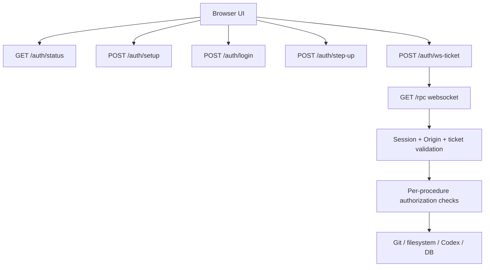

# Security Remediation Plan

## Summary

This plan turns the findings in `docs/2026-04-03-security-audit.md` into an implementation sequence. The short version is:

1. lock down transport and filesystem exposure first
2. add real authentication and session management to the app
3. require step-up authentication for dangerous actions
4. reduce stored plaintext and cross-project privilege bleed

The requested password/PIN and 2FA should be added, but not as a cosmetic login screen. It has to sit on top of a real backend trust model:

- authenticated HTTP session
- HTTPS/WSS transport
- authenticated websocket upgrade
- strict `Origin` checks
- short-lived websocket tickets
- per-action authorization for dangerous operations

If we skip those pieces, a hostile web page could still drive `localhost` even after a UI login exists.

The baseline policy should be:

- no RPC access before authorization
- no project, worktree, thread, or filesystem metadata before authorization
- no `/health` internals before authorization
- no Codex, MCP, task, or git operations before authorization
- no dangerous-action exceptions before authorization

Only the minimum bootstrap surface for auth itself should remain reachable.

TLS is also a good idea, with one important caveat:

- TLS improves transport security
- TLS does not solve localhost trust or authorization by itself
- if the app stays browser-first on `localhost`, certificate management has to be handled intentionally

Recommended policy:

- require TLS for any non-loopback bind
- prefer TLS for loopback production mode too, if the app can provision or rely on a locally trusted certificate
- keep an explicit dev exception only behind a development flag

## Recommended Authentication Model

### Primary factor

Use a local master credential for unlock.

- Recommended: master password or passphrase
- Supported for convenience: optional quick-unlock PIN
- Do not rely on a short 4-6 digit PIN as the only secret for the whole system

Recommended product shape:

- v1 setup requires a master password/passphrase
- v2 can add an optional quick-unlock PIN backed by OS keychain storage or a separate local verifier

Reasoning:

- the master secret can protect sessions and data-at-rest keys
- a short PIN is good UX, but weak as the only root secret

### Second factor

Use TOTP as the first real 2FA factor.

- setup flow generates a TOTP secret and recovery codes
- login requires password plus TOTP
- high-risk actions require recent step-up auth

Optional later addition:

- WebAuthn or platform passkeys for local browsers that support the flow cleanly

### Session model

- password plus TOTP creates an authenticated session
- session is stored in an `HttpOnly` cookie
- websocket access requires both:
  - valid authenticated session
  - short-lived single-use websocket ticket
- browser transport should use HTTPS and WSS in production
- all websocket upgrades validate `Origin`

### Step-up auth

Require a fresh step-up for privileged actions. Do not treat "logged in" as enough for everything.

Actions that should require step-up:

- enabling `unsafeMode`
- starting a thread in `danger-full-access`
- running package scripts from the UI
- creating a thread outside the current project/worktree scope
- deleting a project
- revealing recovery codes or resetting auth settings

## Target Security Architecture

## Default-Deny Policy

The backend should behave as locked by default.

Before authorization:

- deny `/rpc` entirely
- deny all project/worktree/thread procedures
- deny any endpoint that reveals repository paths, runtime state, queue stats, or filesystem contents
- deny `/health` except maybe a minimal unauthenticated liveness response if operations truly need it
- do not preload project data into the browser

Allowed before authorization:

- static assets required to render the auth/setup screen
- `GET /auth/status`
- `POST /auth/setup` when auth has not been configured yet
- `POST /auth/login`
- `POST /auth/recovery-login` if recovery flow exists

Allowed only after authorization:

- websocket ticket issuance
- websocket upgrade
- all app data routes and procedures
- all Codex, git, filesystem, and task actions

Transport policy:

- if running outside explicit development mode, the authenticated app should only be served over HTTPS/WSS
- plaintext HTTP/WS should be rejected or redirected when TLS is configured
- if loopback-only TLS cannot be made reliable immediately, keep plaintext loopback as a temporary development-only exception, not the long-term production model

In other words: the unlocked app is a different trust state, not just a different screen.

## Phased Plan

## Phase 0: Immediate Containment

Goal: remove the highest-risk exposures before the full auth UX lands.

Work:

- Fix worktree path traversal in `src/bun/git.ts`
- Reject websocket upgrades without an allowed `Origin`
- Explicitly bind to loopback only
- Minimize `/health` output
- Temporarily gate or disable the most dangerous unauthenticated procedures until auth is in place
- Move to explicit default-deny for all non-auth surfaces
- design TLS mode and certificate strategy

Code areas:

- `src/bun/index.ts`
- `src/bun/git.ts`
- `src/bun/project-procedures.ts`

Acceptance criteria:

- `readWorktreeFileContentPage` rejects `..` path escape attempts
- websocket requests from unexpected origins fail
- `/health` does not reveal internal queue state in normal mode
- unauthenticated callers cannot reach any app RPC or app data surfaces
- there is a clear production policy for HTTPS/WSS versus dev HTTP/WS

## Phase 1: Authentication Foundation

Goal: add a real app auth system and authenticated websocket transport.

Work:

- Add auth tables to `src/bun/db.ts`
- Add new backend modules:
  - `src/bun/auth.ts`
  - `src/bun/auth-session.ts`
  - `src/bun/auth-totp.ts`
- Add HTTP auth routes:
  - `GET /auth/status`
  - `POST /auth/setup`
  - `POST /auth/login`
  - `POST /auth/logout`
  - `POST /auth/ws-ticket`
  - `POST /auth/step-up`
- Set `HttpOnly`, `SameSite=Strict`, secure session cookies where applicable
- Require auth for `/rpc`
- Move websocket ticketing into the browser startup flow
- Keep the unauthenticated route allowlist as small as possible
- add TLS listener/configuration support and certificate loading

Code areas:

- `src/bun/index.ts`
- `src/bun/db.ts`
- `src/mainview/index.ts`
- new UI auth screens/components in `src/mainview/app/`

Acceptance criteria:

- the app shows setup flow on first run
- the app shows login flow after setup
- websocket connection cannot be established without valid session plus ticket
- existing arbitrary websites cannot drive `/rpc`
- no project or runtime data is returned before login
- production mode uses HTTPS/WSS

## Phase 2: Authorization And Privilege Separation

Goal: split ordinary usage from dangerous execution.

Work:

- Add authorization checks around sensitive procedures
- Require recent step-up auth for dangerous actions
- Stop treating `unsafeMode` as a persistent convenience flag without re-auth
- Make dangerous-mode approval one-shot or short-lived
- Restrict MCP sidecar to the bound thread/project/worktree by default
- Add explicit privileged override path for cross-project actions

Code areas:

- `src/bun/project-procedures.ts`
- `src/bun/codex-sidecar-mcp.ts`
- `src/bun/rpc-schema.ts`
- `src/mainview/App.tsx`
- `src/mainview/app/*`

Acceptance criteria:

- enabling `unsafeMode` always triggers step-up
- `runProjectTask` requires step-up
- `new_thread` in the sidecar cannot pivot to another project without explicit privileged approval

## Phase 3: Data Protection And Persistence Cleanup

Goal: reduce the amount of sensitive state stored in plaintext and persistent browser storage.

Work:

- Remove or heavily restrict the temp-directory DB fallback
- Store app data only in a controlled per-user location
- Apply stricter file permissions on auth and DB artifacts
- Stop persisting `chatInput` in `localStorage`
- Stop persisting `pendingThreadUnsafeMode` across sessions
- Consider encrypting sensitive DB fields or the full DB with a key derived from the master secret or stored via OS keychain
- Encrypt TOTP secret and recovery material at rest

Code areas:

- `src/bun/db.ts`
- `src/mainview/app/state.ts`
- possibly a new `src/bun/crypto.ts`

Acceptance criteria:

- browser persistence no longer stores unsent chat text
- auth secrets and recovery material are not stored in plaintext
- DB does not silently fall back to a shared temp location

## Phase 4: Hardening And Recovery Flows

Goal: make the security model usable and maintainable.

Work:

- Add recovery-code flow
- Add rate limiting and lockout/backoff on login and TOTP attempts
- Add audit trail for auth changes and privileged actions
- Add security headers:
  - CSP
  - frame restrictions
  - referrer policy
- Add session expiry and idle timeout
- Add dev-only auth bypass only behind explicit env flag, default off

Acceptance criteria:

- users can recover from lost 2FA device with recovery codes
- repeated login failures slow down or lock out attempts
- privileged actions are auditable

## Concrete Backend Design

## New DB state

Add tables roughly like:

- `auth_settings`
  - setup complete flag
  - password hash params
  - encrypted TOTP secret
  - created/updated timestamps
- `auth_sessions`
  - session id
  - issued at
  - expires at
  - last used at
  - step-up valid until
- `auth_recovery_codes`
  - hashed recovery codes
  - used at
- `auth_websocket_tickets`
  - ticket id
  - session id
  - issued at
  - expires at
  - consumed at

Implementation notes:

- use a memory-hard password hash such as Argon2id
- hash recovery codes before storage
- keep websocket tickets short-lived and single-use

## HTTP and websocket changes

Update `src/bun/index.ts` to:

- set security headers on HTML and JSON responses
- support TLS listener startup and certificate configuration
- validate `Origin` on websocket upgrade
- reject `/rpc` unless the request has:
  - authenticated session
  - valid ticket
- enforce default-deny for all non-auth routes
- keep unauthenticated HTTP access limited to:
  - setup/login/status routes
  - static assets needed to render the login/setup UI
- return locked/unauthorized responses instead of partial app data

Important design note:

- do not inject the websocket auth secret directly into a static JS asset
- fetch a short-lived ticket through an authenticated same-origin request and use that ticket for websocket connection
- if the app supports non-loopback access, require HTTPS/WSS and reject plaintext transport entirely

## TLS Strategy

The right TLS approach depends on how this app will be shipped.

### If this remains a browser app on localhost

Options:

- ship with instructions or tooling to create a locally trusted certificate
- integrate with a local certificate helper such as a development CA flow
- keep plain HTTP only for explicit development mode

Tradeoff:

- localhost TLS improves transport guarantees and cookie security
- certificate provisioning adds setup complexity

### If this may bind beyond loopback

Policy should be strict:

- require TLS
- require secure cookies
- require WSS for websocket transport
- reject startup if TLS cert/key are missing

### Recommended product decision

- loopback dev mode: HTTP/WS allowed only with explicit dev flag
- loopback production mode: prefer HTTPS/WSS if certificate setup is feasible
- non-loopback mode: HTTPS/WSS mandatory

## UI and UX plan

### First-run flow

1. Open app
2. `GET /auth/status`
3. If not configured, show setup screen
4. User sets master password
5. App enrolls TOTP
6. App shows recovery codes and requires acknowledgement
7. App logs in and opens websocket

### Normal login flow

1. Open app
2. Password entry
3. TOTP entry
4. Session cookie issued
5. UI requests websocket ticket
6. UI opens websocket

### Privileged action flow

1. User clicks dangerous action
2. Server responds with "step-up required" if session is not fresh enough
3. UI shows step-up dialog
4. User re-enters password or PIN and TOTP
5. Server marks session step-up window valid for a short period
6. UI retries the action

## File-Level Implementation Plan

Backend:

- `src/bun/index.ts`
  - add auth routes, cookie parsing, origin checks, ticket checks, security headers
- `src/bun/db.ts`
  - add auth/session/recovery/ticket schema
- `src/bun/project-procedures.ts`
  - add authz wrappers and step-up checks
- `src/bun/git.ts`
  - add real path-containment helper for worktree reads
- `src/bun/codex-sidecar-mcp.ts`
  - enforce thread/project/worktree scope

Frontend:

- `src/mainview/index.ts`
  - fetch auth status, perform login, request websocket ticket before opening `/rpc`
- `src/mainview/App.tsx`
  - branch between auth screens and main app
- `src/mainview/app/state.ts`
  - remove risky persistence
- new files under `src/mainview/app/`
  - `auth-setup.tsx`
  - `auth-login.tsx`
  - `auth-step-up-dialog.tsx`
  - `auth-recovery-codes.tsx`

## Testing Plan

Unit and integration coverage should include:

- login success and failure paths
- TOTP verification and recovery-code fallback
- websocket connection denied without session
- websocket connection denied with bad `Origin`
- websocket ticket expiry and one-time use
- plaintext transport rejected in production TLS mode
- step-up enforcement on `unsafeMode` and task execution
- worktree traversal rejection
- sidecar cross-project escape rejection

Manual test matrix:

- first-time setup
- restart and login
- expired session during normal use
- expired step-up during dangerous action
- lost 2FA device recovery
- logout from one browser tab while another tab is open

## Proposed Delivery Order

If we want the fastest risk reduction with the least rework:

1. Fix path traversal
2. Add websocket `Origin` checks and loopback-only binding
3. Add TLS policy and listener support
4. Add session auth and websocket ticketing
5. Add password plus TOTP setup/login UI
6. Add step-up auth for dangerous actions
7. Restrict sidecar scope
8. Clean up persistence and storage

## Open Product Decisions

These need decisions before implementation starts:

- Should v1 require a master password, or allow PIN-only mode?
- Should TOTP be mandatory or optional on first-run setup?
- Do we want recovery codes printable/exportable only once?
- Should `unsafeMode` be completely disabled until step-up auth exists?
- Do we allow any dev bypass, and if so what exact env flag enables it?

## Recommendation

My recommendation is:

- require master password in v1
- require TOTP in v1
- make quick-unlock PIN a follow-up feature
- treat `unsafeMode` and task execution as step-up protected
- do not ship auth without websocket/session enforcement

That gets you the requested password/PIN and 2FA direction, but in a way that actually closes the security holes called out in the audit.
