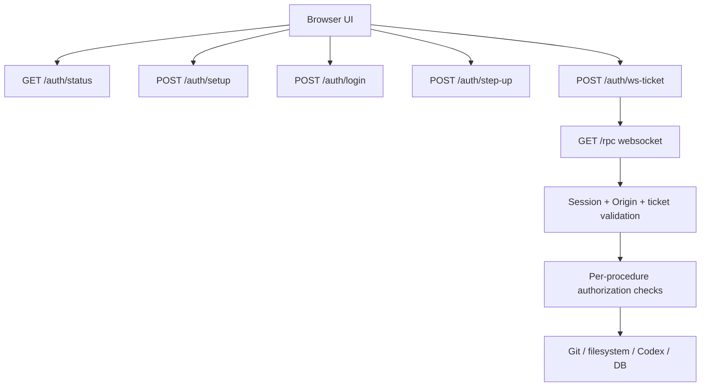

# Security Remediation Plan

## Summary

This plan turns the findings in `docs/2026-04-03-security-audit.md` into an implementation sequence. The short version is:

1. lock down transport and filesystem exposure first
2. add real authentication and session management to the app
3. require step-up authentication for selected high-risk actions
4. reduce stored plaintext and cross-project privilege bleed

The requested password/PIN and 2FA should be added, but not as a cosmetic login screen. It has to sit on top of a real backend trust model:

- authenticated HTTP session
- loopback-only transport with optional HTTPS/WSS
- authenticated websocket upgrade
- strict `Origin` checks
- short-lived websocket tickets
- per-action authorization for dangerous operations

If we skip those pieces, a hostile web page could still drive `localhost` even after a UI login exists.

The baseline policy should be:

- no RPC access before authorization
- no project, worktree, thread, or filesystem metadata before authorization
- no `/health` internals before authorization
- no Codex, MCP, task, or git operations before authorization
- no dangerous-action exceptions before authorization

Only the minimum bootstrap surface for auth itself should remain reachable.

Current product assumption:

- the app is a single-user local app
- one local installation maps to one logical account and one auth setup flow
- this simplifies the initial design for sessions and recovery
- the implementation should still avoid painting itself into a corner if multi-user support is added later

TLS is also a good idea, with one important caveat:

- TLS improves transport security
- TLS does not solve localhost trust or authorization by itself
- if the app stays browser-first on `localhost`, certificate management has to be handled intentionally

Recommended policy:

- bind to loopback only and do not depend on TLS for the local security boundary
- keep HTTPS/WSS support optional for users who want it
- if the app ever supports non-loopback access later, revisit and require TLS for that mode

## Recommended Authentication Model

### Primary factor

Use a local master credential for unlock.

- User chooses one primary factor during setup:
  - PIN
  - master password or passphrase

Primary-factor policy:

- the choice is made at setup time and stored in auth settings
- changing between PIN and password later should require full re-auth plus TOTP
- PIN mode needs stronger guardrails because it is easier to brute force than a password
- minimum PIN length is 6
- three failed primary-factor attempts trigger a 10-minute lockout

Reasoning:

- password/passphrase mode gives stronger entropy by default
- PIN mode is acceptable only with strict rate limiting, backoff, and lockout behavior
- both modes can still protect sessions and gate access when paired with mandatory TOTP
- PIN mode should reject trivial values even though the minimum length is 6

### Second factor

Use TOTP as the first real 2FA factor.

- TOTP is mandatory
- setup flow generates a TOTP secret and recovery codes
- login requires PIN plus TOTP or password plus TOTP
- recovery login requires the primary factor plus one unused recovery code
- high-risk actions require recent step-up auth
- 10 recovery codes are generated up front and shown to the user during setup

Optional later addition:

- WebAuthn or platform passkeys for local browsers that support the flow cleanly

### Session model

- password plus TOTP creates an authenticated session
- session is stored in an `HttpOnly` cookie
- normal session lifetime is one week
- idle session timeout defaults to 24 hours without authenticated activity
- websocket access requires both:
  - valid authenticated session
  - short-lived single-use websocket ticket
- browser transport may use HTTPS/WSS when local certificate material is configured
- all websocket upgrades validate `Origin`

### Step-up auth

Require a fresh step-up for privileged actions. Do not treat "logged in" as enough for everything.

Implementation default:

- step-up freshness lasts 10 minutes after a successful primary-factor plus TOTP re-check
- idle session timeout lasts 24 hours after the last authenticated HTTP or RPC activity

Actions that should require step-up:

- running package scripts from the UI
- creating a thread outside the current project/worktree scope
- deleting a project
- revealing recovery codes or resetting auth settings
- generating or regenerating recovery codes

## Target Security Architecture

## Default-Deny Policy

The backend should behave as locked by default.

Before authorization:

- deny `/rpc` entirely
- deny all project/worktree/thread procedures
- deny any endpoint that reveals repository paths, runtime state, queue stats, or filesystem contents
- deny `/health` except maybe a minimal unauthenticated liveness response if operations truly need it
- do not preload project data into the browser

Allowed before authorization:

- static assets required to render the auth/setup screen
- `GET /auth/status`
- `POST /auth/setup` when auth has not been configured yet
- `POST /auth/login`
- `POST /auth/recovery-login`

Allowed only after authorization:

- websocket ticket issuance
- websocket upgrade
- all app data routes and procedures
- all Codex, git, filesystem, and task actions

Transport policy:

- authenticated transport stays loopback-only
- plaintext HTTP/WS is acceptable for the current local-only app model
- if TLS is configured, prefer HTTPS/WSS automatically without changing the auth model

In other words: the unlocked app is a different trust state, not just a different screen.

## Explicit Product Decisions

These are chosen requirements for implementation:

- users may choose either PIN mode or password mode as the primary factor
- TOTP is mandatory for every account
- the app must provide a web-based TOTP setup flow with a QR code for authenticator apps
- the setup flow must include a manual secret fallback in addition to the QR code
- 10 recovery codes should be generated during TOTP setup and given to the user up front
- recovery codes are view-once when first generated
- regenerating recovery codes should require a fresh authenticated CLI flow using the configured primary factor plus TOTP
- no app access is allowed before successful authorization
- `unsafeMode` remains available after normal app authentication
- TLS is optional
- if TLS remains supported, the product may provide an easy local setup path on supported platforms
- if the user has command-line access, the product should expose a reset path that uses CLI plus OTP verification
- TLS setup may be Codex-assisted, but only as an optional guided bootstrap flow with user approval for system-changing commands
- a dev bypass is allowed only through an explicit development/reset flow
- a dev reset flow may intentionally wipe local database contents

## Phased Plan

## Phase 0: Immediate Containment

Goal: remove the highest-risk exposures before the full auth UX lands.

Work:

- Fix worktree path traversal in `src/bun/git.ts`
- Reject websocket upgrades without an allowed `Origin`
- Explicitly bind to loopback only
- Minimize `/health` output
- Temporarily gate or disable the most dangerous unauthenticated procedures until auth is in place
- Move to explicit default-deny for all non-auth surfaces
- keep TLS support optional and separate from the auth boundary

Code areas:

- `src/bun/index.ts`
- `src/bun/git.ts`
- `src/bun/project-procedures.ts`

Acceptance criteria:

- `readWorktreeFileContentPage` rejects `..` path escape attempts
- websocket requests from unexpected origins fail
- `/health` does not reveal internal queue state in normal mode
- unauthenticated callers cannot reach any app RPC or app data surfaces
- there is a clear loopback-only transport policy and TLS remains optional

## Phase 1: Authentication Foundation

Goal: add a real app auth system and authenticated websocket transport.

Work:

- Add auth tables to `src/bun/db.ts`
- Add new backend modules:
  - `src/bun/auth.ts`
  - `src/bun/auth-secrets.ts`
  - `src/bun/auth-service.ts`
- Add HTTP auth routes:
  - `GET /auth/status`
  - `POST /auth/setup/start`
  - `POST /auth/setup`
  - `POST /auth/login`
  - `POST /auth/logout`
  - `POST /auth/ws-ticket`
  - `POST /auth/step-up`
- Set `HttpOnly`, `SameSite=Strict`, secure session cookies where applicable
- Require auth for `/rpc`
- Move websocket ticketing into the browser startup flow
- Keep the unauthenticated route allowlist as small as possible
- keep optional TLS listener/configuration support and certificate loading
- keep any certificate bootstrap flow explicitly optional
- add first-run setup screens for:
  - primary-factor choice: PIN or password
  - TOTP enrollment with QR code
  - recovery-code display and acknowledgement

Code areas:

- `src/bun/index.ts`
- `src/bun/db.ts`
- `src/mainview/index.ts`
- new UI auth screens/components in `src/mainview/app/`

Acceptance criteria:

- the app shows setup flow on first run
- setup lets the user choose PIN mode or password mode
- setup requires TOTP enrollment before the account becomes usable
- setup shows a QR code that can be scanned by an authenticator app
- setup displays 10 pre-generated recovery codes
- setup treats recovery codes as view-once material
- the app shows login flow after setup
- websocket connection cannot be established without valid session plus ticket
- existing arbitrary websites cannot drive `/rpc`
- no project or runtime data is returned before login
- HTTP/WS works on loopback without weakening the auth/session boundary

Implementation note:

- The current implementation may use per-user default loopback certificate paths under the app-data directory plus `bun run tls:bootstrap` for optional local certificate generation.
- `mkcert` is the preferred optional bootstrap path because it can install a locally trusted root CA; OpenSSL remains a fallback generator for environments where `mkcert` is unavailable.

## Phase 2: Authorization And Privilege Separation

Goal: split ordinary usage from dangerous execution.

Work:

- Add authorization checks around sensitive procedures
- Require recent step-up auth for dangerous actions
- Keep `unsafeMode` available after normal app auth, but clearly label it and audit its use
- Restrict MCP sidecar to the bound thread/project/worktree by default
- Add explicit privileged override path for cross-project actions

Code areas:

- `src/bun/project-procedures.ts`
- `src/bun/codex-sidecar-mcp.ts`
- `src/bun/rpc-schema.ts`
- `src/mainview/App.tsx`
- `src/mainview/app/*`

Acceptance criteria:

- `runProjectTask` requires step-up
- `new_thread` in the sidecar cannot pivot to another project without explicit privileged approval
- `unsafeMode` is available after login, clearly marked in the UI, and auditable

Implementation note:

- the current implementation can satisfy the unsafe-mode audit requirement with persistent local security audit events plus an in-product warning banner whenever unsafe mode is active

## Phase 3: Data Protection And Persistence Cleanup

Goal: reduce the amount of sensitive state stored in plaintext and persistent browser storage.

Work:

- Remove or heavily restrict the temp-directory DB fallback
- Store app data only in a controlled per-user location
- Apply stricter file permissions on auth and DB artifacts
- Stop persisting `chatInput` in `localStorage`
- Stop persisting `pendingThreadUnsafeMode` across sessions
- Consider encrypting sensitive DB fields or the full DB with a key derived from the master secret or stored via OS keychain
- Encrypt TOTP secret and recovery material at rest

Code areas:

- `src/bun/db.ts`
- `src/mainview/app/state.ts`
- possibly a new `src/bun/crypto.ts`

Implementation note:

- Do not silently fall back to the OS temp directory for the SQLite DB.
- If the default per-user app data directory is unavailable, require an explicit `JOLT_APP_DATA_DIR` override instead.

Acceptance criteria:

- browser persistence no longer stores unsent chat text
- auth secrets and recovery material are not stored in plaintext
- DB does not silently fall back to a shared temp location

## Phase 4: Hardening And Recovery Flows

Goal: make the security model usable and maintainable.

Work:

- Add recovery-code flow
- Add rate limiting and lockout/backoff on login and TOTP attempts
- Add audit trail for auth changes and privileged actions
- Add security headers:
  - CSP
  - frame restrictions
  - referrer policy
- Add session expiry and idle timeout
- Add CLI credential-reset flow that requires OTP verification for users with command-line access
- Add dev-only auth bypass/reset flow behind explicit env flags, default off

Acceptance criteria:

- users can recover from lost 2FA device with recovery codes
- three failed login attempts trigger a 10-minute lockout
- privileged actions are auditable
- HTML and JSON responses send browser hardening headers, including CSP, frame restrictions, and referrer policy
- command-line reset requires OTP verification
- dev bypass/reset is impossible unless explicitly enabled

## Concrete Backend Design

## New DB state

Add tables roughly like:

- `auth_settings`
  - setup complete flag
  - primary factor type: `pin` or `password`
  - primary factor hash params
  - encrypted TOTP secret
  - session lifetime config
  - created/updated timestamps
- `auth_sessions`
  - session id
  - issued at
  - expires at
  - last used at
  - step-up valid until
- `auth_recovery_codes`
  - hashed recovery codes
  - used at
- `auth_websocket_tickets`
  - ticket id
  - session id
  - issued at
  - expires at
  - consumed at

Implementation notes:

- use a memory-hard password hash such as Argon2id
- use the same class of strong password hashing for PIN mode too
- PIN mode must enforce minimum length 6 plus attempt throttling and a 10-minute lockout after three failures
- hash recovery codes before storage
- pre-generate 10 recovery codes during setup
- recovery-code generation is view-once at setup
- recovery-code regeneration must require a fresh authenticated CLI flow with the configured primary factor plus TOTP
- keep websocket tickets short-lived and single-use

## HTTP and websocket changes

Update `src/bun/index.ts` to:

- set security headers on HTML and JSON responses
- support optional TLS listener startup and certificate configuration
- validate `Origin` on websocket upgrade
- reject `/rpc` unless the request has:
  - authenticated session
  - valid ticket
- enforce default-deny for all non-auth routes
- keep unauthenticated HTTP access limited to:
  - setup/login/status routes
  - static assets needed to render the login/setup UI
- return locked/unauthorized responses instead of partial app data

Important design note:

- do not inject the websocket auth secret directly into a static JS asset
- fetch a short-lived ticket through an authenticated same-origin request and use that ticket for websocket connection
- if the app ever supports non-loopback access, add a stricter TLS policy at that point instead of treating loopback plaintext as a current bug

## TLS Strategy

TLS should be treated as optional local transport hardening, not as a required part of the single-user localhost security model.

### If this remains a browser app on localhost

Options:

- ship with built-in tooling or a guided helper to create a locally trusted certificate
- integrate with a local certificate helper such as a development CA flow
- avoid making users configure certificates manually if possible
- support a Codex-assisted bootstrap flow that can perform TLS setup from an explicit user prompt

Tradeoff:

- localhost TLS improves transport guarantees and cookie security
- certificate provisioning adds setup complexity
- a Codex-assisted bootstrap is ergonomic, but it still needs explicit approval before certificate trust changes or privileged OS commands run

### If this may bind beyond loopback

Policy should be strict:

- require TLS
- require secure cookies
- require WSS for websocket transport
- reject startup if TLS cert/key are missing

### Recommended product decision

- loopback mode: HTTP/WS allowed by default
- optional HTTPS/WSS may be enabled automatically when local certs are configured
- keep loopback-only binding as the primary transport control
- if non-loopback support is ever added, require HTTPS/WSS there
- if TLS support remains in the product, `bun run tls:bootstrap` is an optional local helper rather than a startup prerequisite

## UI and UX plan

### First-run flow

1. Open app
2. `GET /auth/status`
3. If not configured, show setup screen
4. User chooses primary factor mode: PIN or password
5. User sets the chosen primary factor
6. App renders a TOTP enrollment website/page with:
   - QR code
   - manual secret fallback
   - issuer/account label for authenticator apps
7. User confirms a valid TOTP code
8. App shows 10 pre-generated recovery codes and requires acknowledgement
9. App logs in and opens websocket

### Normal login flow

1. Open app
2. PIN or password entry, depending on configured mode
3. TOTP entry
4. Session cookie issued
5. UI requests websocket ticket
6. UI opens websocket

### Privileged action flow

1. User clicks dangerous action
2. Server responds with "step-up required" if session is not fresh enough
3. UI shows step-up dialog
4. User re-enters password or PIN and TOTP
5. Server marks session step-up window valid for a short period
6. UI retries the action

## File-Level Implementation Plan

Backend:

- `src/bun/index.ts`
  - add auth routes, cookie parsing, origin checks, ticket checks, security headers
- `src/bun/db.ts`
  - add auth/session/recovery/ticket schema
- `src/bun/auth-reset.ts`
  - implement CLI reset and recovery-code regeneration flow with configured primary factor plus OTP verification
- `src/bun/dev-reset.ts`
  - implement explicit dev bypass/reset flow with optional database wipe
- `src/bun/project-procedures.ts`
  - add authz wrappers and step-up checks
- `src/bun/git.ts`
  - add real path-containment helper for worktree reads
- `src/bun/codex-sidecar-mcp.ts`
  - enforce thread/project/worktree scope

Frontend:

- `src/mainview/index.ts`
  - fetch auth status, perform login, request websocket ticket before opening `/rpc`
- `src/mainview/App.tsx`
  - branch between auth screens and main app
- `src/mainview/app/state.ts`
  - remove risky persistence
- new files under `src/mainview/app/`
  - `auth-setup.tsx`
  - `auth-login.tsx`
  - `auth-totp-enrollment.tsx`
  - `auth-step-up-dialog.tsx`
  - `auth-recovery-codes.tsx`

## Testing Plan

Unit and integration coverage should include:

- login success and failure paths
- TOTP verification and recovery-code fallback
- websocket connection denied without session
- websocket connection denied with bad `Origin`
- websocket ticket expiry and one-time use
- plaintext loopback transport allowed when no TLS material is configured
- `unsafeMode` access after normal login
- step-up enforcement on task execution and recovery/reset flows
- worktree traversal rejection
- sidecar cross-project escape rejection
- CLI reset flow requiring OTP verification
- recovery-code regeneration via authenticated CLI flow
- dev bypass/reset flow with optional DB wipe

Current implementation coverage:

- `src/bun/auth-service.test.ts` covers setup, TOTP login, recovery-code login, auth lifecycle audit events, invalid-credential lockout auditing, session issuance, idle expiry, lockout, websocket ticket issuance/consumption, and step-up freshness
- `src/bun/rpc-websocket-auth.test.ts` covers websocket upgrade denial without session/ticket plus cookie-clearing behavior for expired sessions
- `src/bun/server-security.test.ts` covers websocket `Origin` allowlisting, CSP generation, and shared browser security headers
- `src/bun/tls-config.test.ts` and `src/bun/tls-bootstrap.test.ts` cover optional TLS runtime selection, the guided bootstrap flow, and TLS bootstrap audit logging
- `src/bun/rpc-authz.test.ts` covers step-up gating for privileged RPC actions
- `src/bun/project-security-audit.test.ts` covers audit-event persistence for cross-workspace thread creation, queued task execution, and project deletion
- `src/bun/auth-reset.test.ts` covers authenticated CLI reset and recovery-code regeneration flows, including audit-event persistence
- `src/bun/security-audit.test.ts` covers bounded audit-log reads, project/thread scoping, and payload normalization for the UI-facing audit procedure
- `src/bun/security-audit-cli.test.ts` covers CLI audit-log argument parsing and human-readable formatting

Manual test matrix:

- first-time setup
- first-time setup in PIN mode
- first-time setup in password mode
- three failed-attempt 10-minute lockout in PIN mode
- three failed-attempt 10-minute lockout in password mode
- restart and login
- `unsafeMode` toggle/use after normal login
- expired session during normal use
- expired step-up during dangerous action
- lost 2FA device recovery
- CLI reset with OTP verification
- recovery-code regeneration via CLI after fresh auth round
- dev reset with database wipe
- logout from one browser tab while another tab is open

## Proposed Delivery Order

If we want the fastest risk reduction with the least rework:

1. Fix path traversal
2. Add websocket `Origin` checks and loopback-only binding
3. Add optional TLS listener support
4. Add session auth and websocket ticketing
5. Add password plus TOTP setup/login UI
6. Add step-up auth for selected high-risk actions
7. Restrict sidecar scope
8. Clean up persistence and storage

## Dev Reset Policy

The development/reset behavior should be explicit:

- `JOLT_DEV_BYPASS=1`
  - enables development auth bypass behavior
- `JOLT_DEV_RESET=1`
  - enables development reset behavior
- default dev reset wipes the whole local database
- do not default to partial auth/session-only reset, because whole-DB reset is simpler and safer to reason about in the current single-user app model

## Recommendation

My recommendation is:

- support both PIN mode and password mode in v1
- require TOTP in v1
- provide an app-served TOTP enrollment page with QR code in v1
- make sessions last one week by default
- keep the local security boundary on auth, loopback binding, websocket ticketing, and strict `Origin` checks rather than requiring TLS
- treat TLS as optional loopback hardening, with guided setup only for users who explicitly want it
- expose a CLI reset path for command-line users that still requires OTP verification
- treat recovery codes as view-once material and allow regeneration only through an authenticated CLI flow
- keep `unsafeMode` available after login, but visibly dangerous and auditable
- keep task execution and recovery/reset flows step-up protected
- use `JOLT_DEV_BYPASS=1` and `JOLT_DEV_RESET=1` for explicit development bypass/reset behavior
- make dev reset wipe the full local database by default
- do not ship auth without websocket/session enforcement

That gets you the requested password/PIN and 2FA direction, but in a way that actually closes the security holes called out in the audit.
