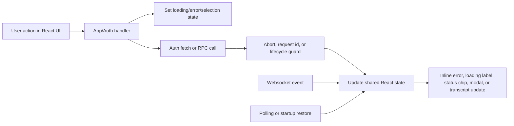

# Frontend Feedback Inventory

Summary

The frontend has a clear pattern for most feedback-critical actions: a UI handler in `src/mainview/App.tsx` or `src/mainview/auth-shell.tsx` sets a local busy/error state immediately, calls an RPC or auth endpoint, then reconciles the result into shared React state. The strongest coverage is around auth, project/worktree lifecycle, thread lifecycle, chat send/stop, task execution, diff refresh, git history, and security-audit refresh.

The current implementation relies on three feedback channels:

- Immediate local state: button disablement, inline loading labels, cleared stale errors, optimistic selection changes, and modal/popover state.
- Request guards: abort controllers, request ids, lifecycle trackers, and stale-selection guards prevent older responses from overwriting newer user intent.
- Background reconciliation: websocket events, polling, and startup restore fill in feedback that is not driven directly by a click, especially for thread status, task list refresh, git history refresh, and startup reopen state.

This document inventories the primary frontend actions that require immediate and correct feedback and describes the current process for each one.

## Scope

Included:

- Auth and step-up flows
- Project, worktree, and thread lifecycle actions
- Chat send/stop flows
- Task execution
- Diff, git-history, and security-audit actions
- Background event paths that materially affect visible feedback

Not included:

- Purely local panel toggles, view switches, and search filtering unless they gate a feedback-critical async flow

## Shared Feedback Architecture

## Inventory At A Glance

| Action | Primary surface | Immediate feedback now | Backend/process path |
| --- | --- | --- | --- |
| Auth bootstrap | `auth-shell.tsx` loading view | Loading copy changes as gate resolution progresses; retry button on failure | `resolveAuthShellGate()` -> `/auth/status` -> setup/login/app |
| Initial auth setup | Setup form | Submit button changes to `Finishing setup…`; inline error strip | `completeAuthSetup()` -> `/auth/setup` |
| TOTP login | Login form | Submit button changes to `Signing in...`; lockout text can update | `loginAuth()` -> `/auth/login` -> `loadGateState()` |
| Recovery-code login | Recovery login form | Submit button changes to `Signing in…`; inline errors/lockout | `loginWithRecoveryCodeAuth()` -> `/auth/recovery-login` -> `loadGateState()` |
| Logout / lock app | Auth shell app chrome | Button changes to `Locking…`; auth shell reopens if session ends | `logoutAuth()` -> `/auth/logout` -> disconnect RPC -> `loadGateState()` |
| Step-up re-auth | `AuthStepUpDialog` | Modal opens, submit changes to `Verifying...`, inline errors stay in dialog | `stepUpAuth()` -> `/auth/step-up`, then retries protected action |
| Add project | Projects panel form | Add button changes to `Adding`; inline error; directory suggestions show `Scanning` | `openProject()` RPC from `useAddProjectForm()` |
| Open project | Projects panel row click | Project row expands immediately; loading state appears if no cached worktrees | `refreshProject(..., true)` -> `openProject()` RPC |
| Close project | Projects panel row click | Collapse intent starts immediately; local close only commits after backend confirms | `refreshProject(..., false)` -> `closeProject()` RPC via rollback-safe helper |
| Open worktree | Project worktree row click | Selection changes immediately; worktree fetch runs if unopened; row-level error can appear | `ensureWorktreeOpen()` -> `openWorktree()` RPC |
| Create worktree | Project action menu | Create button changes to `Creating`; inline menu error stays visible | `createWorktree()` RPC |
| Pin/unpin worktree | Worktree pin button | Pin button disables while busy; errors render under row or in menu | `setWorktreePinned()` RPC |
| Delete project | Project action menu | Errors stay inline; selection/thread state is recalculated after success | `deleteProject()` RPC, wrapped in step-up |
| Create thread | Threads `+` or auto-create | Create button disables; errors surface in threads panel | `createThread()` RPC, sometimes followed by `discardEmptyThread()` cleanup |
| Approve thread-start request | Deferred request flow | Busy flags and thread-start error state update | `createThread()` RPC, optional `sendThreadMessage()` RPC |
| Open thread | Thread row click | Selection swaps immediately, transcript clears, loading placeholder appears | `getThread()` RPC with abort/request-id guards |
| Rename thread | Thread action menu | Save button changes to `Saving`; inline error remains in menu | `renameThread()` RPC |
| Pin/unpin thread | Thread action menu | Action buttons disable while busy; thread list updates on success | `setThreadPinned()` RPC |
| Delete thread | Thread action menu | Buttons disable while busy; selection clears if deleted thread was open | `deleteThread()` RPC |
| Send message | Chat composer | Composer clears immediately; send button becomes stop when run is working; inline chat error restores draft | `sendThreadMessage()` RPC |
| Stop running thread | Chat composer while working | Action label becomes stop; stop errors show inline in chat | `stopThreadTurn()` RPC |
| Change model | Chat controls | Control disables while update is in flight; inline error below controls | `updateThreadModel()` RPC or pending local selection if no thread |
| Change reasoning effort | Chat controls | Control disables while update is in flight; inline error below controls | `updateThreadReasoningEffort()` RPC or pending local selection |
| Toggle unsafe mode | Chat controls | Toggle disables while update is in flight; inline error below controls | `updateThreadUnsafeMode()` RPC or pending local selection |
| Run project task | Chat task selector or Tasks workspace | Task controls disable; task error shows inline; resulting thread opens/updates | `runProjectTask()` RPC, wrapped in step-up |
| Refresh diff snapshot | Diff workspace | Refresh button changes to `Syncing`; loading/error surfaces depend on cached snapshot | `getWorktreeSnapshot()` RPC |
| Load focused file diff | Diff workspace file selection | Selected file changes immediately; patch pane shows loading/error/empty states | `readWorktreeFileDiff()` RPC |
| Load git history | Sidebar git history panel | Panel shows `Loading git history...` or cached list with silent refresh | `listWorktreeGitHistory()` RPC |
| Load more git history | Git history scroll | `Loading more commits...` footer | `listWorktreeGitHistory()` RPC with offset |
| Open commit diff | Git history entry click | Modal opens immediately with cached or loading state; error stays in modal | `getWorktreeGitCommitDiff()` RPC |
| Refresh security audit | Security panel | Refresh icon spins; loading/empty/error states update inline | `listSecurityAuditEvents()` RPC via superseding runner |

## Current Process By Area

### 1. Auth and Access Control

#### Auth bootstrap

Files:

- `src/mainview/auth-shell.tsx`
- `src/mainview/auth-shell-connect.ts`
- `src/mainview/auth-client.ts`
- `src/mainview/index.ts`

Current process:

1. `AuthShell` starts in `loading` and calls `loadGateState()`.
2. `loadGateState()` clears error unless told to preserve it, sets `Checking local authorization state…`, and calls `resolveAuthShellGate()`.
3. `resolveAuthShellGate()` checks `/auth/status`.
4. If authenticated, it tries to open the RPC transport with bounded retry and timeout handling.
5. While retrying transport connect, `AuthShell` updates loading copy to `Opening authenticated workspace…` and then `retrying connection (n/m)…`.
6. If auth is not configured, it fetches setup enrollment and routes to setup.
7. If auth is configured but not authenticated, it routes to login.
8. If an RPC auth failure later occurs, `index.ts` dispatches `jolt:auth-required`, `AuthShell` preserves the reason, and the whole gate-resolution flow runs again.

Immediate feedback now:

- Dedicated loading screen with mutable progress text
- Inline auth error strip
- Retry button when the loading view has an error

#### Setup, login, recovery login, recovery code copy, logout

Current process:

- Setup submit sets `isBusy`, clears error/copy feedback, calls `/auth/setup`, then stores recovery codes and switches to the recovery screen.
- Login submit sets `isBusy`, clears error, calls `/auth/login`, then reruns gate resolution.
- Recovery login submit follows the same pattern against `/auth/recovery-login`.
- Auth failures update the inline error strip and refresh `lockedUntil` when available.
- Recovery-code copy writes to the clipboard and shows a success/failure message in-place.
- Logout calls `/auth/logout`, always disconnects RPC transport, then reruns gate resolution.

Immediate feedback now:

- Busy button text: `Finishing setup…`, `Signing in…`, `Opening workspace…`, `Locking…`
- Recovery copy feedback message
- Lockout banner when `lockedUntil` is present

#### Step-up re-auth for protected actions

Files:

- `src/mainview/App.tsx`
- `src/mainview/app/auth-step-up-dialog.tsx`

Current process:

1. Protected actions call `executeWithStepUp(actionLabel, action)`.
2. The first attempt runs normally.
3. If the RPC fails with `step_up_required`, the app opens `AuthStepUpDialog`.
4. Submitting the dialog calls `/auth/step-up`.
5. Success closes the dialog and retries the original action once.
6. Failure stays inside the dialog as an inline error without losing the action context.

Protected actions currently using this path:

- Delete project
- Create thread outside the current workspace
- Run project task

### 2. Project and Worktree Lifecycle

#### Add project and directory suggestions

Files:

- `src/mainview/app/use-add-project-form.ts`
- `src/mainview/app/projects-panel.tsx`

Current process:

1. Opening the add-project form seeds the input from the home directory.
2. Typing triggers cached, deduplicated, abortable directory suggestion fetches.
3. Suggestions can be prefetched on hover.
4. Submitting the form calls `openProject({ projectPath })`.
5. On success, the project list is updated, project rows are hydrated, the project tree is marked open, the project is selected, and mobile project list state is closed.

Immediate feedback now:

- `Scanning` label while directory suggestions refresh
- Hover preview styling in the path field
- `Adding` label on submit
- Inline add-project error below the form

#### Open and close project

Files:

- `src/mainview/App.tsx`
- `src/mainview/project-close.ts`
- `src/mainview/project-lifecycle.ts`

Current process:

1. Clicking a project row calls `refreshProject(project, nextOpen)`.
2. The app starts a project lifecycle request so stale responses can be ignored.
3. Opening:
   - Marks the project tree open immediately.
   - Shows `loadingWorktrees` when there is no cached worktree list.
   - Calls `openProject()`.
   - On success, updates the project record and worktree list.
4. Closing:
   - Calls `closeProject()` through `runRollbackSafeProjectClose()`.
   - Local close state is committed only after backend success.
   - On success, worktree state is cleared, project `isOpen` becomes `0`, project tree closes, and selected worktree falls back to the project path.
   - On failure, the row stays open and the error is stored on the project state.

Immediate feedback now:

- Open attempts show project/worktree loading state only when needed
- Close attempts are rollback-safe rather than optimistic
- Project-level error text is rendered in the projects panel state

#### Open worktree

Files:

- `src/mainview/App.tsx`
- `src/mainview/app/projects-panel.tsx`

Current process:

1. Clicking a worktree row immediately updates selection and clears thread selection if needed.
2. The app tries to sync the selected worktree to an existing preferred thread, or auto-creates a thread if none exists.
3. If the worktree is not open yet, `ensureWorktreeOpen()` runs.
4. `ensureWorktreeOpen()` marks the worktree as loading, calls `openWorktree()`, primes task and git-history caches, stores the snapshot, and marks the worktree as open.
5. Errors stay on the specific worktree state.

Immediate feedback now:

- Selection changes before the RPC finishes
- Row-level worktree errors render directly under the row
- Request ids prevent stale open responses from corrupting newer toggles

#### Create worktree, pin/unpin worktree, delete project

Current process:

- Create worktree runs from the project action menu, disables create while any create/pin operation is active, and keeps error text inline in the menu.
- Pin/unpin worktree sets a single busy path, disables competing pin actions, and updates the parent project worktree list on success.
- Delete project runs behind step-up, reloads projects and threads after success, clears removed project state, closes its tree path, and repairs current selection.

Immediate feedback now:

- Create button text changes to `Creating`
- Pin button disables while busy
- Delete failures remain visible either in the menu or in project state

### 3. Thread Lifecycle and Chat

#### Create thread

Files:

- `src/mainview/App.tsx`
- `src/mainview/app/threads-panel.tsx`

Current process:

1. The thread `+` button or auto-create path calls `createThreadForWorktree()`.
2. The app sets `isCreatingThread`, clears thread/chat/control errors, and calls `createThread()` with the active model, reasoning effort, and unsafe mode.
3. If the worktree is no longer the active selection when the RPC returns, the app discards the empty thread with `discardEmptyThread()`.
4. If still relevant, the new thread becomes selected, messages are populated, thread context is synced, and worktree metadata is refreshed in the background.

Immediate feedback now:

- Create button disables
- Errors surface as `threadsError`
- Stale auto-created threads are actively cleaned up

#### Deferred thread-start requests

Files:

- `src/mainview/index.ts`
- `src/mainview/App.tsx`

Current process:

1. The websocket can emit `thread-start-request-created`.
2. `index.ts` dispatches `jolt:thread-start-request-created`.
3. `App.tsx` appends the request into `pendingThreadStartRequests`.
4. Approving the request creates a thread and optionally immediately sends the queued input.
5. Failures set both `threadStartRequestError` and `threadsError`.

Immediate feedback now:

- Pending requests are queued in arrival order
- Approval flow shares the same busy flags as normal thread creation

#### Open thread

Files:

- `src/mainview/App.tsx`
- `src/mainview/app/thread-list-row.tsx`

Current process:

1. Clicking a thread row dismisses terminal status badges, clears completed indicators, acknowledges unread errors in the background, and calls `openThread(threadId)`.
2. `openThread()` aborts earlier thread-open work, updates selection immediately, clears transcript, syncs lightweight context from the summary row if available, and sets `isThreadLoading`.
3. It then loads full thread detail through `getThread()` or a prefetched bootstrap promise.
4. On success, it replaces the selected transcript and syncs project/worktree context.
5. On failure, it leaves selection in place and shows `threadsError`.

Immediate feedback now:

- Immediate row selection
- Transcript placeholder: `Loading thread history...`
- Error preview state is cleared before opening the thread

#### Rename, pin/unpin, delete thread

Files:

- `src/mainview/App.tsx`
- `src/mainview/app/action-menus.tsx`

Current process:

- Rename validates title, sets `threadActionBusy = "rename"`, calls `renameThread()`, updates the thread list, and leaves the menu open.
- Pin/unpin sets `threadActionBusy = "pin"`, calls `setThreadPinned()`, and updates the thread list.
- Delete sets `threadActionBusy = "delete"`, calls `deleteThread()`, removes the thread from the list, clears selection if needed, and closes the menu on success.

Immediate feedback now:

- Busy button labels: `Saving`
- All thread menu actions disable while any one is in progress
- Inline error strip stays visible without closing the menu

#### Send message and stop run

Files:

- `src/mainview/App.tsx`
- `src/mainview/controls/chat-composer-control.tsx`
- `src/mainview/thread-send.ts`
- `src/mainview/app/use-mainview-derived-state.ts`

Current process:

1. Submit goes through a single `onSubmit` handler.
2. If the selected thread is currently working, submit becomes `stopSelectedThreadTurn()`.
3. Otherwise it becomes `postMessage()`.
4. `postMessage()` reads the shared composer draft, validates selection, sets `isSending`, clears chat error, and immediately clears the composer draft.
5. It calls `sendThreadMessage()`.
6. Success updates the thread summary and merges returned messages into the selected transcript if the same thread is still selected.
7. Failure restores the prior draft if the draft is still empty and shows `chatError` only when the failed request still belongs to the selected thread.
8. `stopSelectedThreadTurn()` sets `isStoppingThread`, clears chat error, calls `stopThreadTurn()`, and merges returned transcript state on success.

Immediate feedback now:

- Composer action label switches between `Send message` and `Stop current run`
- Send button changes visual mode when a run is active
- Composer clears immediately on send
- Failed sends can restore the message draft
- Run failures and stop notices surface inline in the transcript via derived `activeChatError` and `activeChatNotice`

#### Thread status polling and completion feedback

Files:

- `src/mainview/App.tsx`
- `src/mainview/thread-status-refresh.ts`

Current process:

1. If any thread is working, the app polls `listThreads()` on an interval.
2. When needed, it also refreshes the selected thread detail via `getThread()`.
3. The outcome helper ensures the refreshed detail only applies if the same thread is still selected.
4. Separate effects detect transitions from `working` to `idle` and mark those threads as `completed`.
5. Mobile navigation indicators switch between `working`, `completed`, and `none`.

Immediate feedback now:

- Sidebar/workspace thread rows show `Working`, `Completed`, `Run failed`, `Stopped`, or `Unread`
- Selected transcript may show `Processing`
- Terminal status can be dismissed per thread

### 4. Chat Control Mutations

Files:

- `src/mainview/App.tsx`
- `src/mainview/app/chat-workspace.tsx`
- `src/mainview/app/use-mainview-derived-state.ts`

Current process:

- Model, reasoning effort, and unsafe mode each have a dedicated updater.
- If no thread is selected, the chosen value is stored as pending state for the next thread.
- If a thread is selected, the updater sets a local busy flag, calls the mutation RPC, updates the thread record, and keeps the chosen value in pending state for consistency.

Immediate feedback now:

- Each control can be disabled independently while updating
- Errors render directly below the control strip
- Unsafe mode shows an explanatory tooltip when enabled

### 5. Project Tasks

Files:

- `src/mainview/App.tsx`
- `src/mainview/app/tasks-workspace.tsx`
- `src/mainview/controls/project-task-selector.tsx`

Current process:

1. Task lists load whenever the selected open worktree changes.
2. Requests are cached, abortable, and keyed per worktree.
3. Selecting a task from the chat dropdown or clicking a task in the Tasks workspace calls `runSelectedTask()`.
4. The app validates project/worktree selection, sets `isRunningProjectTask`, clears task/chat/control errors, and calls `runProjectTask()` behind step-up.
5. The returned thread is upserted into the thread list and becomes the selected thread when it still matches the active worktree selection.

Immediate feedback now:

- Task list surfaces `Loading project tasks...`, empty, and error states
- Task execution disables selectors/buttons through derived `taskSelectorDisabled`
- Task errors render inline in both chat and tasks surfaces

### 6. Diff Workspace

Files:

- `src/mainview/app/use-worktree-diff.ts`
- `src/mainview/app/diff-workspace.tsx`

Current process:

1. When the diff view is active and the document is visible, the app loads the current worktree snapshot and starts a 2.5-second polling loop.
2. Manual refresh uses the same snapshot path but shows explicit foreground loading.
3. Snapshot requests are abortable and supersede older requests.
4. When worktree changes update, the app keeps the selected file path valid or falls back to the first changed file.
5. File selection triggers `readWorktreeFileDiff()`.
6. Background snapshot refresh can also refresh the visible file patch without clearing the patch pane if the current patch is still usable.

Immediate feedback now:

- Refresh button changes to `Syncing`
- Panel-level states: `Loading worktree diff...`, error, clean worktree, empty focused diff
- File-level states: `Loading focused diff...`, patch error, no diff available

### 7. Git History

Files:

- `src/mainview/App.tsx`
- `src/mainview/app/git-history-panel.tsx`

Current process:

1. Git history loads when the selected project/worktree changes.
2. Results are cached by worktree and can be shown immediately while a silent refresh happens in the background.
3. Scrolling near the end triggers `loadMoreGitHistory()`.
4. Hover/focus/pointer-down on a commit row preloads the commit diff.
5. Clicking a commit opens the diff modal immediately with cached content when available or in a loading state otherwise.
6. Diff fetches are deduplicated, cached, abortable, and protected by request ids.

Immediate feedback now:

- Panel states: loading, loading more, empty, error
- Commit diff modal opens immediately instead of waiting for the RPC
- Modal error stays scoped to the opened commit diff

### 8. Security Audit

Files:

- `src/mainview/App.tsx`
- `src/mainview/app/security-audit-panel.tsx`
- `src/mainview/security-audit-refresh.ts`

Current process:

1. Opening the Security panel triggers the first refresh if data has not loaded yet.
2. Switching `All` / `Project` / `Thread` scope triggers another refresh.
3. A 15-second interval keeps the panel refreshed while it remains open.
4. The refresh runner serializes requests and lets a newer scope replace an older queued one before it starts.
5. The loader ignores stale completions with `isLatestRequest()`.

Immediate feedback now:

- Refresh button disables and spins while loading
- Inline states for first-load, empty list, and error
- Scope buttons disable when project/thread scope is unavailable

## Background Event Paths That Affect Feedback

### Websocket to DOM event bridge

Files:

- `src/mainview/index.ts`
- `src/mainview/App.tsx`

Current process:

- `tasks-changed` websocket messages dispatch `jolt:worktree-tasks-changed`, which reloads tasks for the selected open worktree.
- `git-history-changed` websocket messages dispatch `jolt:worktree-git-history-changed`, which silently refreshes git history for the selected worktree.
- `thread-start-request-created` websocket messages dispatch `jolt:thread-start-request-created`, which appends a pending thread-start request.

### Startup restore

Files:

- `src/mainview/App.tsx`
- `src/mainview/startup-project-restore.ts`
- `src/mainview/startup-worktree-restore.ts`

Current process:

1. `initialize()` loads bootstrap data, threads, and model catalog.
2. Projects are treated as closed locally until `openProjectsBatch()` confirms reopen success.
3. Failed project reopen results can move selection to a fallback project.
4. Persisted open worktrees are filtered so only successfully reopened projects can restore them.
5. `openWorktreesBatch()` restores worktree snapshots, tasks, and git history caches.
6. Selection is reconciled again so stale worktree paths do not survive startup.

Immediate feedback now:

- Startup intentionally avoids showing projects/worktrees as open before confirmation
- Failed restore targets collapse rather than remaining in a stale open state

## Current Patterns Worth Noting

- Most feedback-critical flows clear stale error state before starting a new request.
- The frontend prefers scoped inline feedback over global toasts.
- Request supersession is handled consistently with abort controllers or request ids.
- The project close path is notably safer than many other flows because local collapse is deferred until backend success.
- Chat send is the most optimistic user-facing flow: it clears the composer immediately and repairs state on failure by restoring the draft when appropriate.
- Background event handling is important for correctness because not all visible feedback comes from the initiating click path.

