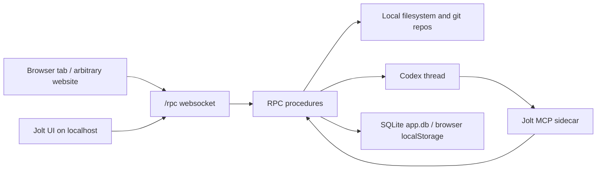

# Security Audit: jt-ide

## Summary

- Audit date: 2026-04-03
- Scope: current repository snapshot in `/home/jtenner/Projects/jt-ide`
- Method: static source review of Bun backend, RPC transport, Codex/MCP integration, persistence, and browser UI; targeted runtime check of Bun bind behavior; dependency advisory check with `bun audit`
- Overall result: high risk
- Historical note: this is a point-in-time report from 2026-04-03. It predates later websocket-auth hardening for session cookies + short-lived tickets and should be read as historical context rather than current state.
- Most important issues:
  - unauthenticated websocket RPC can be driven by any local process and by arbitrary web pages through cross-site websocket hijacking
  - worktree file reads are vulnerable to path traversal and can disclose arbitrary local files outside the repository
  - the app can start Codex sessions with `approvalPolicy: "never"`, network access, and `danger-full-access`
  - the sidecar MCP layer does not enforce project/worktree isolation

## Finding Summary

| Severity | Count | Findings |
| --- | --- | --- |
| Critical | 2 | Unauthenticated RPC control surface; arbitrary file read via path traversal |
| High | 2 | Privileged Codex execution without approval gate; sidecar cross-project/worktree escape |
| Medium | 4 | Plaintext persistence with temp-directory fallback; browser localStorage persistence of session data; `/health` information disclosure; missing transport/browser hardening |
| Informational | 2 | Dependency audit result; reviewed areas with no major issue found |

## Scope And Method

This audit focused on the code that defines the app's trust boundaries:

- HTTP and websocket entrypoints in `src/bun/index.ts` and the historical split-launcher static server
- RPC procedures and Codex orchestration in `src/bun/project-procedures.ts`
- filesystem and git helpers in `src/bun/git.ts`
- persistence in `src/bun/db.ts`
- MCP sidecar tooling in `src/bun/codex-sidecar-mcp.ts`
- browser transport and storage in `src/mainview/index.ts` and `src/mainview/app/state.ts`

I did not perform a live penetration test against a running desktop session, and I did not audit Bun itself or the OpenAI SDK implementation internals. The findings below are based on the repository state on 2026-04-03.

## Threat Model Used

The app is a local IDE-like tool, so the relevant attackers are:

- a malicious website opened in the user's browser while Jolt is running on `localhost`
- a malicious local process running as the same user
- prompt injection or hostile repository content that causes a Codex thread to misuse its tools
- another local user on a shared machine, especially if data falls back to a temporary directory

The app is not primarily exposed to the public internet by default. A quick runtime check showed Bun reporting `hostname: "localhost"`. That reduces remote-network exposure, but it does not protect against browser-based localhost attacks or same-user local processes.

## Trust Boundaries



The security model depends almost entirely on who can reach `/rpc` and what those procedures are allowed to do.

## Detailed Findings

### 1. Critical: unauthenticated websocket RPC allows full local app takeover

**What is wrong**

The backend upgrades any request to `/rpc` without checking:

- `Origin`
- authentication tokens
- a session secret
- whether the caller is the Jolt UI

Code evidence:

- `src/bun/index.ts:1021-1025` upgrades any `/rpc` request
- `src/bun/index.ts:1082-1123` dispatches whatever valid RPC method name arrives
- `src/bun/project-procedures.ts:181-184` exposes all tracked projects
- `src/mainview/index.ts:98-113` shows the UI connects to a predictable localhost websocket URL

**Why this matters**

Any local process can connect directly. More importantly, any website the user visits can attempt `new WebSocket("ws://localhost:7599/rpc")`. Because the server does not validate the `Origin` header, this becomes a cross-site websocket hijacking issue.

Once connected, the attacker can:

- enumerate tracked projects and worktrees
- read file contents and diffs
- create threads
- toggle unsafe mode
- send prompts to Codex
- run project tasks that execute local package scripts
- delete or mutate app state

This is effectively full control over the local automation surface.

**Impact**

- confidentiality: severe
- integrity: severe
- availability: severe

**Exploit path**

1. Victim runs Jolt locally.
2. Victim visits a malicious website.
3. The site opens `ws://localhost:7599/rpc`.
4. The site sends JSON RPC messages such as `listProjects`, `openProject`, `createThread`, `updateThreadUnsafeMode`, `sendThreadMessage`, or `runProjectTask`.
5. The app performs the actions with the victim's local privileges.

**Recommended fix**

- Require a per-session random bearer token for every websocket client.
- Reject websocket upgrades unless the request presents that token.
- Enforce an `Origin` allowlist for browser clients.
- Consider binding the RPC server to a random high port plus an unguessable capability token instead of a predictable endpoint.
- Separate read-only and mutating methods, and gate the dangerous ones independently.

### 2. Critical: path traversal in worktree file reads allows arbitrary local file disclosure

**What is wrong**

`normalizeGitPath()` resolves a user-supplied path and then returns a relative path from the worktree, even when the result escapes the worktree:

- `src/bun/git.ts:545-547`

`readWorktreeFileContentPage()` then resolves that escaped relative path back into an absolute path and reads it from disk without any containment check:

- `src/bun/git.ts:1007-1063`

The RPC procedure forwards `params.path` directly into that function after only checking that the worktree itself is tracked:

- `src/bun/project-procedures.ts:3226-3252`

**Why this matters**

An attacker who can call RPC can read arbitrary files on the local machine, not just repository files. Example payloads can target:

- `~/.ssh/*`
- shell history files
- cloud credentials
- API key files
- files from unrelated projects

This also affects synthetic diff helpers that call `normalizeGitPath()` and then read `fullPath` directly for added files:

- `src/bun/git.ts:624-650`
- `src/bun/git.ts:676-716`

So the root bug is broader than a single endpoint.

**Example**

If the active worktree is `/home/user/repo`, a request with:

```json
{
  "type": "request",
  "id": 1,
  "method": "readWorktreeFileContentPage",
  "params": {
    "projectId": 1,
    "worktreePath": "/home/user/repo",
    "path": "../../.ssh/id_rsa"
  },
  "priority": "foreground"
}
```

would normalize to `../../.ssh/id_rsa` and then read `/home/user/.ssh/id_rsa`.

**Impact**

- confidentiality: severe
- integrity: not direct through this endpoint
- availability: moderate

**Recommended fix**

- Replace `normalizeGitPath()` with a helper that verifies the resolved path remains inside the worktree after `realpath`.
- Reject any path whose relative form starts with `..` or is absolute.
- Re-check containment after symlink resolution, not just path string normalization.
- Apply the same containment helper to every place that reads `fullPath` from worktree-relative input.

### 3. High: privileged Codex execution can run with network access and no approval barrier

**What is wrong**

Codex thread options are set to:

- `approvalPolicy: "never"`
- `networkAccessEnabled: true`
- `sandboxMode: "danger-full-access"` when `unsafeMode` is enabled

Code evidence:

- `src/bun/project-procedures.ts:705-720`

Threads can be created directly with `unsafeMode` set at creation time:

- `src/bun/project-procedures.ts:2496-2515`

Existing threads can be switched into unsafe mode without a second factor or confirmation path:

- `src/bun/project-procedures.ts:3034-3048`

The sidecar explicitly documents that `unsafeMode` causes immediate start instead of waiting for a popup:

- `src/bun/codex-sidecar-mcp.ts:744-852`

**Why this matters**

Once combined with finding 1, this is an immediate privilege escalation from "website can reach localhost" to "website can induce local autonomous code execution with network egress." Even without finding 1, prompt injection inside a trusted repository can persuade the agent to use unsafe mode because the backend has no out-of-band approval requirement.

**Impact**

- confidentiality: severe
- integrity: severe
- availability: severe

**Recommended fix**

- Do not allow `danger-full-access` from ordinary RPC calls.
- Require an explicit user gesture in the UI for every unsafe-mode run.
- Separate "thread preference" from "current execution privilege"; the latter should expire after one run.
- Disable network access by default for local coding threads unless explicitly approved.
- Record and surface an immutable audit trail for every privileged run.

### 4. High: the MCP sidecar does not enforce project or worktree isolation

**What is wrong**

The sidecar is started with bound context:

- `JOLT_PROJECT_ID`
- `JOLT_THREAD_ID`
- `JOLT_WORKTREE_PATH`

But `new_thread` accepts arbitrary `projectId`, `projectPath`, and `worktreePath`, and `resolveWorktreeTarget()` will search all known projects to satisfy them:

- `src/bun/codex-sidecar-mcp.ts:431-471`
- `src/bun/codex-sidecar-mcp.ts:744-863`

`listKnownProjects()` is backed by the app-wide `listProjects` RPC:

- `src/bun/codex-sidecar-mcp.ts:326`
- `src/bun/project-procedures.ts:181-184`

**Why this matters**

A Codex thread that is supposed to be scoped to one worktree can create or start work in other tracked projects. That breaks the most natural isolation boundary in the product.

This matters in two cases:

- prompt injection in one repository can pivot into another repository
- a user may assume "this thread only has access to this worktree" when the tool layer does not enforce that

**Impact**

- confidentiality: high across projects
- integrity: high across projects

**Recommended fix**

- Default the sidecar to the bound thread/project/worktree only.
- Reject cross-project or cross-worktree targets unless the user explicitly authorizes them in the UI.
- Split the tool into:
  - a strictly scoped default tool
  - an explicitly privileged "spawn outside current worktree" tool

### 5. Medium: sensitive data is stored in plaintext SQLite and may fall back to a temp directory

**What is wrong**

The app stores projects, threads, messages, diffs, command outputs, errors, and model metadata in a local SQLite database. If the normal app data directory is not writable, it falls back to `tmpdir()`:

- `src/bun/db.ts:144-157`
- `src/bun/db.ts:192-235`

The code creates directories with default permissions and does not apply explicit file mode hardening or encryption:

- `src/bun/db.ts:193-196`
- `src/bun/db.ts:202-208`
- `src/bun/db.ts:218-235`

**Why this matters**

The database can contain:

- private prompts
- command output
- diffs containing secrets
- project paths that reveal internal codebase layout
- thread summaries and failure messages

If the app falls back to a shared temp location such as `/tmp/.jolt`, the exposure to other local users is materially worse.

**Impact**

- confidentiality: medium to high on shared machines

**Recommended fix**

- Remove the temp-directory fallback for normal operation, or make it opt-in only.
- Create the app data directory with restrictive permissions and verify them.
- Store the database file with user-only permissions where the platform permits it.
- Consider encrypting especially sensitive fields or the whole database at rest.

### 6. Medium: browser localStorage persists session context and unsent input

**What is wrong**

The UI stores selected project/worktree/thread, unsafe-mode preference, sidebar data, open worktrees, and the current chat input in `localStorage`:

- `src/mainview/app/state.ts:681-719`
- `src/mainview/app/state.ts:758-793`

**Why this matters**

This is lower risk than the SQLite issue, but it still means sensitive context and unfinished prompts persist in the browser profile. If the browser profile is compromised, shared, synced, or inspected by extensions, that data is exposed.

**Recommended fix**

- Do not persist `chatInput` by default.
- Treat unsafe-mode preference as ephemeral session state, not persistent state.
- Consider a "privacy mode" that disables browser persistence entirely.

### 7. Medium: `/health` exposes internal runtime state without authentication

**What is wrong**

The backend returns a JSON health payload with runtime details to any caller on `/health`:

- `src/bun/index.ts:1061-1064`

That payload includes:

- RPC URL
- port
- client count
- git scheduler stats
- procedure queue stats

**Why this matters**

On its own this is mainly information disclosure, but in combination with the unauthenticated RPC surface it helps an attacker fingerprint the instance and time attacks. The static server also proxies backend health details.

**Recommended fix**

- Restrict `/health` to authenticated local UI callers or a debug mode.
- Return a minimal boolean liveness payload in normal mode.

### 8. Medium: HTTP and websocket transport lack standard browser hardening controls

**What is wrong**

Responses are served with only `content-type` and `cache-control` in the common helpers:

- `src/bun/index.ts:301-321`
- the historical split-launcher response helper

There is no evidence of:

- Content Security Policy
- `X-Frame-Options` or `frame-ancestors`
- `Referrer-Policy`
- `Cross-Origin-Opener-Policy`
- websocket `Origin` validation

**Why this matters**

These headers would not solve the core RPC auth problem, but they would reduce browser abuse and make accidental XSS or embedding issues less damaging.

**Recommended fix**

- Add a strict CSP suitable for this app.
- Deny framing.
- Validate websocket origins.
- Add explicit security headers on all HTML and JSON responses.

## Additional Notes

### Dependency advisory result

I ran `bun audit` on 2026-04-03. It reported:

```text
No vulnerabilities found
```

That is useful, but it does not reduce the severity of the application-level findings above.

### Areas reviewed without major findings

These areas looked comparatively sound in this snapshot:

- React markdown rendering does not use raw HTML and does not use `dangerouslySetInnerHTML` for model output
- task file resolution in `project-procedures/project-tasks.ts` has explicit path containment checks for `.tasks`
- SQL writes use bound parameters rather than string-built user SQL
- task discovery uses realpath-based traversal guards to avoid obvious symlink loops

## Recommended Remediation Order

1. Lock down `/rpc`.
   - add session authentication
   - enforce websocket `Origin`
   - rotate a random capability token on startup

2. Fix path containment.
   - replace `normalizeGitPath()` usage for filesystem reads
   - add realpath-based in-worktree enforcement
   - regression-test traversal and symlink escapes

3. Add privilege barriers for Codex execution.
   - require explicit UI approval for unsafe mode
   - separate network access from ordinary thread execution
   - make privileged runs one-shot, not persistent

4. Enforce sidecar scope.
   - bound worktree by default
   - explicit approval for cross-project actions

5. Harden storage and transport.
   - remove temp fallback or lock it down
   - reduce browser persistence
   - limit `/health`
   - add security headers

## Suggested Regression Tests

- websocket upgrade rejects requests with missing or untrusted auth
- websocket upgrade rejects unexpected `Origin`
- `readWorktreeFileContentPage` rejects `../` traversal
- `readWorktreeFileContentPage` rejects symlink escape outside worktree
- `readWorktreeFileDiff` rejects traversal payloads
- unsafe mode cannot be enabled without an explicit privileged approval path
- sidecar `new_thread` cannot target another project unless an override token is present

## Bottom Line

The app's current security posture is dominated by two architectural problems:

1. the RPC server trusts any local websocket client
2. worktree file reads do not enforce worktree containment

Those two issues alone are enough to justify immediate remediation before treating the app as safe for sensitive repositories or credentials.
