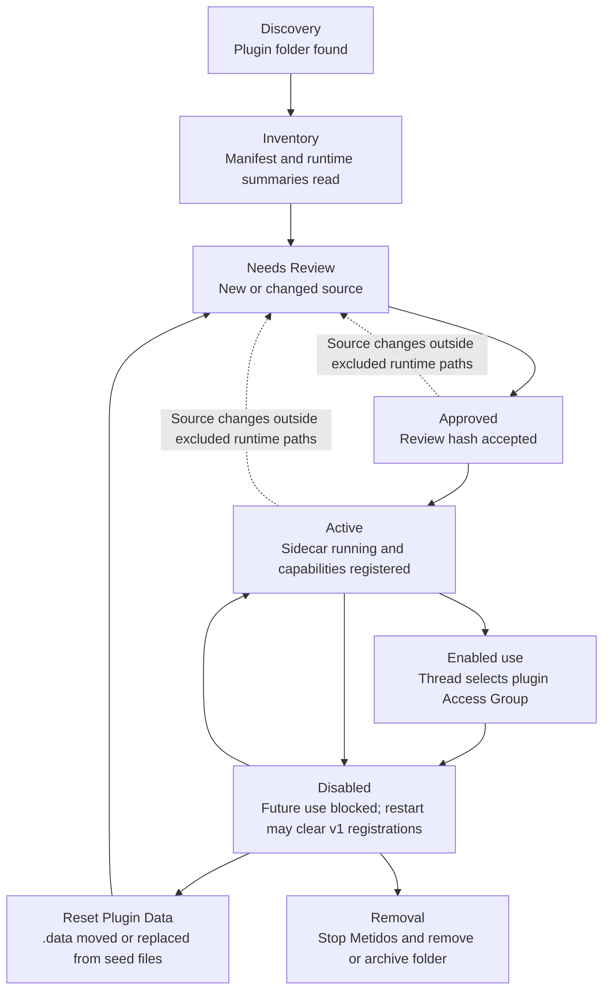

# Plugin system

Plugin System v1 is Metidos' local, review-first extension system. It lets a Local Operator install plugin folders, inspect their declared capabilities, approve the current review hash, and run approved code in sidecars.

This page is the overview. Detailed authoring rules live in:

- [Plugin tutorial](./plugin-tutorial.md) for building, installing, approving, and enabling a minimal local tool plugin.
- [Plugin authoring guide](./metidos-plugin-authoring-guide.md)
- [Plugin AGENTS.md guide](./metidos-plugin-agents-guide.md)
- [Plugin decisions](./metidos-plugin-decisions.md)
- [Plugin manifest schema](./metidos-plugin.schema.json)
- [Copyable examples](./examples/plugins/README.md)

## Status

Plugin System v1 is experimental and local-operator-approved. Plugin APIs, manifest fields, and lifecycle details may still change before a stable public release. Treat plugins as code you review before running.

## Install location and folder shape

Plugins live under App Data:

```text
APP_DATA/plugins/{plugin_id}/
  metidos-plugin.json
  AGENTS.md
  index.ts
  seed/
  .data/
  .logs/
```

`metidos-plugin.json`, `AGENTS.md`, and the manifest `main` file are required. Runtime data and logs are not source and should not be committed.

## Lifecycle

1. **Discovery** — Backend lists immediate child folders under `APP_DATA/plugins/` without executing code.
2. **Inventory** — Backend reads manifest summary and runtime data summaries safely for Settings -> Plugins.
3. **Needs Review** — new or changed source must be reviewed by the Local Operator.
4. **Approval** — the Local Operator approves the current deterministic review hash.
5. **Activation** — approved code runs in a per-plugin sidecar and registers declared capabilities.
6. **Active use** — selected Threads can enable plugin access groups; host APIs enforce manifest permissions.
7. **Disable** — disables future use and may require restart to fully remove v1 registered capabilities.
8. **Reset Plugin Data** — moves or replaces plugin-owned `.data` according to reset behavior and seed files.
9. **Removal** — stop Metidos, remove or archive the plugin folder, and start again.

Changes outside excluded runtime paths invalidate the previous approval hash and require review again.



## Review and approval

Before approval, inspect:

- plugin identity and folder name,
- manifest permissions,
- access groups and tools exposed to Threads,
- settings and secret fields,
- environment declarations,
- network allowlists,
- filesystem allowlists and denied paths,
- provider registrations,
- crons and callback timeouts,
- ingress sources and reply behavior,
- notification provider registration,
- `AGENTS.md` repair/reset guidance,
- review hash and changed files.

Enable, Re-approve, Retry Plugin, and Run Plugin GC require recent step-up authentication because they can approve or execute plugin code.

## Permissions and access groups

A manifest **Permission** grants a host capability to approved plugin code. An **Access Group** controls which plugin tools are visible to a selected Thread.

Access groups do not grant host APIs by themselves. For example, selecting an access group that exposes a tool does not grant `files:read` unless the manifest also has the relevant file permission and allowlist.

Common capability areas include:

- storage read/write in plugin `.data`,
- plugin logging,
- project file read/write through `./` virtual paths,
- network fetch and websocket access,
- SQLite in plugin storage,
- notification provider registration,
- model provider registration,
- embedding consumption or provision,
- agent tools,
- global plugin crons,
- plugin GC callbacks,
- request ingress,
- prompt injection.

See the [plugin permission reference](./plugin-permissions.md), authoring guide, and JSON schema for exact permission names, capabilities, risk levels, user-facing explanations, and validation rules.

## Settings and secrets

Plugin Settings are one per-plugin map stored in App Data in `plugin-settings-v1.json`. The manifest declares each setting key, label, description, kind, required state, optional default, and any enum/list constraints. Supported setting kinds are `string`, `number`, `boolean`, `enum`, `secret`, `url`, `date`, and `list`.

Secret settings are for local-operator-provided credentials such as API tokens, passwords, or sensitive provider topics. On save, scalar secret values are encrypted with the local auth secret key and plugin/key-specific authenticated data. Saving a secret as `null` clears the stored secret. Legacy plaintext or legacy-scoped encrypted plugin secrets are re-encrypted the next time they are read when possible; unreadable encrypted values are treated as unset and should be repaired by saving the setting again.

Display, diagnostics, and reset behavior:

- Settings UI and ordinary RPC snapshots request unreadable secrets, so secret `value` and `defaultValue` are returned as `null`; the UI can still show whether a stored value exists.
- Runtime startup receives materialized setting values, including secrets, only for the plugin whose sidecar is starting.
- Host diagnostics should identify setting keys and repair guidance without including secret values. Plugin-authored logs, thrown errors, tool results, provider output, or notification messages are not automatically redacted in v1.
- Reset Plugin Data affects plugin-owned `.data`; it does not clear Plugin Settings. Clear a secret by saving `null` or by removing/resetting the plugin settings state under App Data using operator-approved repair steps.

Rules:

- Use fake values in docs and examples.
- Do not paste real Plugin Settings into issues.
- Prefer settings/env declarations over hard-coded secrets.
- Do not put defaults on `env` declarations marked `secret`; secret settings may have scalar defaults only when the value is not a real credential.
- Remember plugin-authored logs and tool results may include whatever the plugin writes; review plugins accordingly.

## Filesystem behavior

Plugin filesystem APIs use virtual roots:

- `~/` maps to plugin-owned `.data`.
- `./` maps to the current Thread/project Worktree when available and permitted.

The Backend rejects traversal, symlink escapes, sensitive denied paths such as `.git` and `.ssh`, and attempts to read plugin source/manifest through project file access. Project file access requires both thread context and manifest allowlist coverage.

## Network behavior

Network fetch/websocket APIs require explicit permissions and manifest allowlists. HTTPS/WSS is expected by default. Private-network or broad-domain access should be treated as high risk and approved only when the plugin's purpose requires it.

Network policy failures should surface as plugin-visible errors without exposing unrelated host details.

## Model providers

A plugin can register model provider families when it owns the provider transport, model discovery, or request execution. The manifest must declare each provider family in `providers[]` with stable operator-facing metadata such as `id`, `name`, `description`, and `timeoutMs`, and it must include `provider:register`. Provider code must register matching families during plugin startup with `metidos.providers.addProvider(...)` or `registerProvider(...)`; late or undeclared registration is a contract failure.

Credentials should come from declared Plugin Settings or `env` entries, not source code. If Pi already owns the provider transport and catalog, use manifest-level `piAuth` to hand credentials to that existing Pi provider instead of registering a new provider family. If the plugin owns dynamic configurations, each returned configuration can include ordered `piAuth` fallbacks so the host can resolve the correct credential for that configuration. Secret values are stored by Metidos, materialized only for the plugin runtime or Pi auth handoff, and must not be logged or exposed in diagnostics.

The request flow is: the Local Operator installs and reviews the plugin folder, approves the current review hash, fills any required settings, and activates the plugin; during startup the plugin registers provider families and returns provider configurations/models; Metidos publishes stable Pi model ids derived from the plugin/provider/configuration/model identity; when a Thread or Cron selects one of those models, Pi sends execution or embedding requests through the registered plugin callback under host-enforced timeouts, settings, network policy, and permissions. Refresh failures should leave diagnostics or empty/placeholder model lists rather than inventing unsafe fallback models.

User approval is part of the provider contract. Review `providers[]`, requested permissions, settings/env secrets, network allowlists, embedding capability, and whether raw prompts or embedding input can leave the local machine before enabling the plugin. Source changes outside excluded runtime paths require re-review before the changed provider code can run.

## Notification providers

A plugin can register notification provider families such as an ntfy, webhook, or email outlet. The manifest must declare each family in `notificationProviders[]` and include `notification:provider`; provider code must register matching families during plugin startup with `metidos.notifications.addProvider(...)` or `registerProvider(...)`.

Provider plugins usually also declare settings or env vars for server URLs, topics, routing names, and API tokens, plus narrow network allowlists for outbound delivery. The Local Operator approves the provider capability, fills in any required settings, and enables the outlet through notification controls before Metidos sends through it.

Notification provider callbacks return receipts. Delivery problems should surface as failed receipts with stable codes and redacted messages instead of crashing Metidos; startup-time contract problems such as undeclared providers, missing permissions, invalid timeouts, or late registration block activation or produce host diagnostics.

See the [authoring guide notification section](./metidos-plugin-authoring-guide.md#notifications) and the [`ntfy_notification_provider` example](./examples/plugins/ntfy_notification_provider/) for the full registration, configuration, permission, and failure-state contract.

## Plugin crons

A plugin can declare global scheduled callbacks. Plugin crons run under plugin lifecycle control and do not automatically receive a selected Project or Worktree. They should be bounded, idempotent, and safe to retry.

Plugin crons are different from operator-created Cron Jobs, which create Pi-powered child Threads tied to a Project and Worktree.

## Minimal example path

Start from the examples index:

- `hello_tool` — minimal TypeScript agent tool.
- `python_hello_tool` — minimal Python agent tool.
- `cron_notification_digest` — global crons and notification sending.
- `ollama_model_provider` — model provider registration.
- `ntfy_notification_provider` — notification provider registration.
- `fake_ingress` — request ingress fixture.
- `vector_memory` — plugin-scoped vector storage.
- `rss_feed_indexer` — RSS/OPML refresh and vector indexing.

Copy the entire example folder to `APP_DATA/plugins/{plugin_id}/`, rename ids and settings, start Metidos, review in Settings -> Plugins, approve, and enable access groups only for Threads that need them.

## Testing guidance

Plugin authors should validate:

- manifest schema and required fields,
- folder identity matches manifest id,
- no root `node_modules/`,
- no committed `.data`, `.logs`, or reset backups,
- declared registrations match code,
- permission failures are clear,
- settings validation and secret redaction,
- network allowlists reject unexpected hosts,
- file allowlists reject traversal and symlink escapes,
- failure states are safe and recoverable.

## Security guidance for users

- Approve only plugins you understand or trust.
- Re-review after source changes.
- Keep Unsafe Mode and private-network access rare.
- Read plugin `AGENTS.md` before manual data repair.
- Reset plugin data instead of hand-editing unless the plugin docs provide a safe repair path.
- Do not share plugin `.data`, `.logs`, settings, secrets, or unredacted diagnostics publicly.
